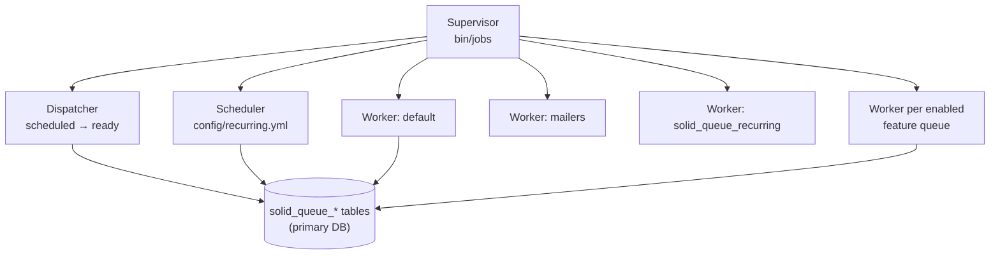

SEEK uses [Solid Queue](https://github.com/rails/solid_queue) as its ActiveJob backend (`config.active_job.queue_adapter = :solid_queue` in `config/application.rb`). Jobs are stored in the `solid_queue_*` tables in the **primary application database** — there is no separate queue database — and processed by a supervisor process that forks one worker per named queue, plus a dispatcher and a scheduler. ActiveJob provides the common interface, so job classes look the same as they did under the old backend.

SEEK moved from Delayed::Job to Solid Queue in 1.19 (#2656). The `delayed_job_active_record` gem, `config/initializers/delayed_job_config.rb` and the `delayed_jobs` table are still present as a rollback safety net, but nothing enqueues onto them any more. See [Upgrading from Delayed::Job](#upgrading-from-delayedjob).

## Process Model



- **Supervisor** — started by `bin/jobs` (`SolidQueue::Cli`). Forks and monitors the other processes, restarting any that die. Writes its pid to `tmp/pids/solid_queue_supervisor.pid` (`SolidQueue.supervisor_pidfile`, set in `config/initializers/solid_queue.rb`).
- **Dispatcher** — moves scheduled jobs (`perform_later` with a `wait:`) onto the ready queue once they are due. Polls every second in batches of 500.
- **Scheduler** — enqueues the recurring tasks in `config/recurring.yml` (production only).
- **Workers** — one process per queue, each with a single thread, claiming and running ready jobs.

Every process heartbeats into `solid_queue_processes`, which is how SEEK reports worker liveness (see [Monitoring](#monitoring)).

## Configuration

### Worker topology: `config/queue.yml`

`config/queue.yml` is an ERB template. It declares one worker per `QueueNames` queue, gated by the same `Seek::Config` feature flags that used to decide which Delayed::Job workers to start:

| Queue | Worker present when |
|---|---|
| `default` | always |
| `mailers` | always |
| `solid_queue_recurring` | always — runs `command:` entries from `recurring.yml` (see below) |
| `authlookup` | `Seek::Config.auth_lookup_enabled` |
| `remotecontent` | `Seek::Config.cache_remote_files` |
| `samples` | `Seek::Config.samples_enabled` |
| `indexing` | `Seek::Config.solr_enabled` |
| `templates` | `Seek::Config.isa_json_compliance_enabled` |
| `datafiles` | `Seek::Config.data_files_enabled` |

Because the flags are read when the supervisor boots, changing one of these settings needs a worker restart to take effect (the admin page says as much).

Points worth knowing:

- **`threads: 1` everywhere.** The `queue.yml` comment explains this was a deliberate first step for the migration: some state was historically process-global (`User.current_user`, the authorization-checks-disabled flag). Those are now thread-local (see [Authorization](../authorization/)), but thread counts have not been raised yet — do so deliberately and test it.
- **`polling_interval: 1`** for each worker, rather than Solid Queue's 0.1s default. With one process per queue a 0.1s poll multiplies into a lot of idle queries. `authlookup` polls at 0.5s because it is the most latency-sensitive queue (`AuthLookupUpdateJob` follows on continuously).
- **`processes: 1`** per queue. With every feature enabled that is 8 workers, which is what `script/check_deployment.rb` expects to see from `/statistics/application_status`.

### `config/initializers/solid_queue.rb`

| Setting | Value | Effect |
|---|---|---|
| `SolidQueue.supervisor_pidfile` | `tmp/pids/solid_queue_supervisor.pid` | Single source for the pid read by the rake tasks, admin page and `script/check_worker_pids.sh` |
| `SolidQueue.clear_finished_jobs_after` | 14 days | Finished jobs are preserved (`preserve_finished_jobs` defaults to true) so they stay visible in the dashboard; the `clear_finished_jobs` recurring task prunes anything older than this |

There is no equivalent of Delayed::Job's `max_attempts`, `max_run_time` or `sleep_delay`: retries are an ActiveJob concern (`retry_on`), the per-job time limit is enforced by `ApplicationJob` (below), and polling is configured in `queue.yml`.

## Named Queues

Queue names are defined in `QueueNames` (`app/jobs/queue_names.rb`):

| Constant | Name | Purpose |
|---|---|---|
| `DEFAULT` | `default` | General-purpose fallback |
| `MAILERS` | `mailers` | Email delivery (`config.action_mailer.deliver_later_queue_name`) |
| `AUTH_LOOKUP` | `authlookup` | Authorization table rebuilds |
| `INDEXING` | `indexing` | Solr reindexing |
| `REMOTE_CONTENT` | `remotecontent` | Remote file and git fetching |
| `SAMPLES` | `samples` | Sample extraction, persistence, and template generation |
| `DATAFILES` | `datafiles` | Data file unzipping |
| `TEMPLATES` | `templates` | ISA template extraction |

A job enqueued on a queue with no worker (because its feature is disabled) is stored but never run until a worker for that queue exists.

## Job Class Hierarchy

### `ApplicationJob`

All jobs inherit from `ApplicationJob`, which inherits from `ActiveJob::Base`. It provides:

- **Default queue:** `QueueNames::DEFAULT`
- **Default priority:** 2
- **Timeout:** wraps `perform` in `Timeout.timeout(timelimit)` — default 15 minutes, overridable per job
- **Error handling:** `rescue_from(Exception)` catches all exceptions and forwards them to `Seek::Errors::ExceptionForwarder`. Re-raises in test mode. Silently ignores `ActiveRecord::RecordNotFound` deserialisation errors (the target record was deleted before the job ran).
- **Follow-on jobs:** after each `perform`, checks `follow_on_job?` — if true, `queue_follow_on_job` enqueues the next job in the chain (after `follow_on_delay`). Used for continuous draining of queue tables. The follow-on is a *new* job with its own ActiveJob id (`self.class.set(...).perform_later(*arguments)`), not a re-enqueue of the current instance — the jobs dashboard looks jobs up by ActiveJob id, so a shared id made every job in a chain resolve to the last one.

### `TaskJob`

For long-running operations that need visible progress tracking. Maintains a `Task` record with states `QUEUED → ACTIVE → DONE / FAILED`. Each subclass must implement `task` returning the associated `Task` instance. On failure, the task is marked `FAILED` and the error message and backtrace are stored.

Used by: `SampleDataExtractionJob`, `UnzipDataFileJob`, `RemoteGitFetchJob`, `FairDataStationImportJob`, and others.

### `BatchJob`

For processing collections of items. Subclasses implement `gather_items` and `perform_job(item)`. Per-item exceptions are caught and reported without aborting the batch. Combine with `follow_on_job?` for continuous processing.

Used by: `ReindexingJob`, `AuthLookupUpdateJob`, `RdfGenerationJob`, `OpenbisSyncJob`.

### `EmailJob`

Base for all email jobs. Ensures `Seek::Config.smtp_propagate` is called before delivery so SMTP settings are up to date.

## Job Priority

Lower numbers run first. Since each queue has its own worker, priority only orders jobs *within* a queue — a priority-0 job on `authlookup` does not jump ahead of anything on `indexing`. The scale used in SEEK:

| Priority | Used by |
|---|---|
| 0 | `UserAuthLookupUpdateJob` — highest urgency |
| 1 | Auth lookup updates, subscriptions, sample type updates, template jobs |
| 2 | Default (`ApplicationJob`) |
| 3 | Maintenance, OpenBIS sync, announcements, email digests |

## Resource Queues

Several high-volume job types use an intermediary database queue table rather than enqueueing one job per item. Items are accumulated in the table, then a single batch job drains them.

The pattern is defined in `ResourceQueue` (`app/models/concerns/resource_queue.rb`):

```ruby
AuthLookupUpdateQueue.enqueue(items)  # accumulate
# AuthLookupUpdateJob drains BATCHSIZE items per run, then follows on

ReindexingQueue.enqueue(items)        # accumulate
# ReindexingJob drains 100 items per run

RdfGenerationQueue.enqueue(items)     # accumulate
# RdfGenerationJob drains 10 items per run
```

Enqueueing is idempotent — if an item is already in the queue table, duplicate entries are not created. A single drain job is also enqueued to ensure a worker picks up the queue.

## How Jobs Are Enqueued

### Direct via `perform_later`

```ruby
RemoteContentFetchingJob.perform_later(content_blob)
LifeMonitorSubmissionJob.perform_later(workflow_version)
```

### Via `queue_job` with optional priority and delay

```ruby
SampleDataExtractionJob.new(data_file, sample_type).queue_job
SampleDataExtractionJob.new(data_file, sample_type).queue_job(priority, 30.seconds)
```

### Via callbacks on models

Most jobs are triggered automatically by model callbacks:

- Item created/updated → `ReindexingQueue.enqueue`, `RdfGenerationQueue.enqueue`, `AuthLookupUpdateQueue.enqueue`
- `ContentBlob` created with a URL → `RemoteContentFetchingJob.perform_later`
- `ActivityLog` created → `ImmediateSubscriptionEmailJob.perform_later` (10-second delay)
- Workflow version saved → `LifeMonitorSubmissionJob.perform_later`
- User destroyed → `AuthLookupDeleteJob.perform_later`

### Via the recurring schedule

Periodic jobs are enqueued by Solid Queue's scheduler from `config/recurring.yml` — see below.

## Recurring Jobs

All periodic application work lives in `config/recurring.yml` and is enqueued by Solid Queue's scheduler. This replaces `config/schedule.rb` and the `whenever` gem, which have been removed (the file is now empty), along with the per-minute `ApplicationStatus` refresh and the `regular_job_offset` setting.

Schedules are standard 5-field cron expressions in **UTC**, parsed by Fugit. Entries are only defined for the `production` environment, so running `bin/jobs` locally never fires subscription emails or other periodic work.

| Schedule (UTC) | Entry | Runs |
|---|---|---|
| `*/10 * * * *` | `queue_timed_jobs` | `ApplicationJob.queue_timed_jobs` — OpenBIS cache refresh and sync, project leaving checks |
| `NewsFeedRefreshJob.cron_schedule` | `news_feed_refresh` | `NewsFeedRefreshJob` (priority 3), at the `home_feeds_cache_timeout` interval |
| every hour at minute 12 | `clear_finished_jobs` | `SolidQueue::Job.clear_finished_in_batches` — prunes finished jobs older than 14 days |
| `0 */4 * * *` | `regular_maintenance` | `RegularMaintenanceJob` — dangling and deleted blobs, stale git repositories, unregistered users, activation email resends, failed FAIR Data Station imports |
| `0 */8 * * *` | `auth_lookup_maintenance` | `AuthLookupMaintenanceJob` — consistency check on auth lookup tables |
| `0 0 * * *` | `periodic_subscription_email_daily` | `PeriodicSubscriptionEmailJob` with `daily` |
| `0 0 * * 0` | `periodic_subscription_email_weekly` | `PeriodicSubscriptionEmailJob` with `weekly` (Sundays) |
| `0 0 1 * *` | `periodic_subscription_email_monthly` | `PeriodicSubscriptionEmailJob` with `monthly` |
| `10 0 * * *` | `bioschema_data_dump_generate` | `Seek::BioSchema::DataDump.generate_dumps` |
| `45 0 * * *` | `sitemap_refresh` | `SitemapRefreshJob` — regenerates the sitemap and pings search engines |
| `0 2 * * *` | `life_monitor_status` | `LifeMonitorStatusJob` — workflow test status check |
| `0 3 * * *` | `galaxy_tool_map_refresh` | `Galaxy::ToolMap.instance.refresh` |
| `0 4 * * *` | `cache_overflow_cleanup` | `CacheOverflowCleanupJob` — filesystem cache sweep and Redis stats |

The heavier daily jobs are staggered across 00:00–04:00 instead of using the old configurable offset.

### `class:` versus `command:` entries

- A **`class:`** entry names an ActiveJob class. The scheduler calls `perform_later` with any `args:`, so the job runs on that class's own queue.
- A **`command:`** entry is arbitrary Ruby, run by `SolidQueue::RecurringJob` via `eval`. That job's queue is `solid_queue_recurring`, which is none of SEEK's named queues — which is why `queue.yml` has a dedicated worker for it. Without that worker, command entries enqueue but never run.

`SitemapRefreshJob` is new: it replaces the `rake sitemap:refresh` cron entry, so the sitemap is regenerated inside a worker instead of in a fresh rake process.

### `NewsFeedRefreshJob.cron_schedule`

`home_feeds_cache_timeout` is a number of minutes, and a bare `*/n * * * *` is only valid for `n` up to 59 — Fugit rejects larger steps, and an invalid schedule **stops the scheduler from starting**. `cron_schedule` converts the setting into a minute-, hour- or day-stepped expression accordingly. Any other schedule derived from a setting needs the same care.

### What is still in cron

Only OS-level process housekeeping that isn't Ruby: `docker/seek.crontab` runs `script/kill-long-running-soffice.sh` every 10 minutes under Supercronic, inside the Docker containers. See [Docker](../docker/).

`test/integration/recurring_test.rb` asserts every entry in `recurring.yml` (it replaced the `whenever-test`-based `schedule_test.rb`). Add to it when you add a recurring entry.

## Worker Management

### Rake tasks

The `seek:workers:*` tasks wrap the supervisor and are what the Docker entrypoints, deployment scripts and admin page call:

```bash
bundle exec rake seek:workers:start    # daemonise bin/jobs (no-op if already running)
bundle exec rake seek:workers:stop     # TERM the supervisor, wait up to ~15s for it to exit
bundle exec rake seek:workers:restart  # stop then start
bundle exec rake seek:workers:status   # report whether the supervisor is running
```

`start` spawns `bundle exec bin/jobs` in its own process group, detached, with output appended to the Rails log (`Rails.application.config.paths['log']`). There is one supervisor and one pidfile, not a pidfile per queue — the supervisor manages its children itself. All four tasks find it through `Seek::Util.solid_queue_supervisor_pid`, which returns nil for a missing or stale pidfile.

`stop` waits for the supervisor to remove its pidfile, so a following `start` (as in `restart`) sees a clean state.

### Admin page

The admin "Restart background job workers" button posts to `AdminController#restart_job_workers` (formerly `restart_delayed_job`), which runs `seek:workers:restart`. Because the new supervisor takes a moment to register, the action sets `flash[:job_workers_restarting]` and the status panel shows a notice with a refresh link, rather than sleeping until a pid appears as the old action did.

The status panel shows the supervisor pid and the list of queues being served by live workers.

### Monitoring

`Seek::Util` (`lib/seek/util.rb`) provides the status helpers:

| Method | Returns |
|---|---|
| `solid_queue_supervisor_pid` | The supervisor pid if its pidfile exists and the process is alive, else nil. Only meaningful on the host/container running the workers |
| `live_job_workers` | `SolidQueue::Process` rows of kind `Worker` whose heartbeat is within `SolidQueue.process_alive_threshold` |
| `active_queue_names` | The queues those live workers are serving |
| `configured_queue_names` | The queues `config/queue.yml` would serve with the current settings, whether or not anything is running |

`live_job_workers` reads from the database, so it works from the web front end even when the workers run in a separate container. `/statistics/application_status` uses it:

```
FAIRDOM-SEEK is running | search is enabled | 8 background job worker processes running
```

This replaced the `ApplicationStatus` model and its `application_status` table (dropped in migration `20260918140000`), which was refreshed every minute by cron and cached a count of Delayed::Job pids.

`script/check_worker_pids.sh` (the `seek_workers` Docker health check) just checks the supervisor pid.

## Jobs Dashboard (Mission Control)

[Mission Control – Jobs](https://github.com/rails/mission_control-jobs) is mounted at `/jobs` (respecting `relative_url_root`) and linked from the admin page as **Job queue dashboard**. It shows queues, ready/scheduled/in-progress/failed/finished jobs and workers, and allows retrying or discarding failed jobs and pausing queues.

Access control:

- `config/initializers/mission_control.rb` sets `MissionControl::Jobs.base_controller_class = 'MissionControlJobsController'` and turns off the gem's HTTP Basic auth. These are set as module attributes rather than `config.mission_control.jobs.*`, because the engine copies that config in a `before_initialize` hook that runs before SEEK's initializers.
- `MissionControlJobsController` (`app/controllers/mission_control_jobs_controller.rb`) inherits from `ApplicationController` and requires `login_required` + `is_user_admin_auth`, so only SEEK admins can reach it.

SEEK customisations, all under `lib/seek/job_dashboard/` and `app/views/mission_control/`:

| Customisation | Where | Why |
|---|---|---|
| Return to SEEK link | `MissionControlJobsController#record_seek_return_path`, `layouts/mission_control/jobs/_application_selection.html.erb` | Remembers the SEEK page the dashboard was entered from (ignoring other-host and dashboard referers) |
| All configured queues listed | `Seek::JobDashboard::AllConfiguredQueues`, prepended to `SolidQueueAdapter` | Mission Control lists only queues that have had a job; this adds empty ones from `configured_queue_names` |
| Duration column on finished jobs | `Seek::JobDashboard::FinishedJobDuration`, prepended to `MissionControl::Jobs::JobsHelper` | Measured from `scheduled_at` to `finished_at`, since Solid Queue deletes the claimed execution (and its start time) on completion — so it includes time spent waiting for a worker |
| First/last page links | `mission_control/jobs/shared/_pagination_toolbar.html.erb` | |

The prepends are applied in a `to_prepare` block so they survive code reloading in development.

The older admin stats panel (`app/views/admin/stats/_job_queue.html.erb`) still exists, now listing unfinished `SolidQueue::Job` rows, and links to the dashboard for the fuller view.

## Failure Handling

`ApplicationJob`'s `rescue_from(Exception)` reports the exception and swallows it, so **from Solid Queue's point of view a failing SEEK job usually finishes normally**. It does not appear as failed in the dashboard; the evidence is in the log and in whatever `ExceptionForwarder` sent. Jobs using `TaskJob` also record the failure on their `Task`.

A job only lands in `solid_queue_failed_executions` if an exception escapes that handler, for example:

- jobs that don't inherit from `ApplicationJob` — mailer deliveries (`ActionMailer::MailDeliveryJob`) and `command:` entries run by `SolidQueue::RecurringJob`
- a `retry_on` that has used up its attempts
- a worker process that died mid-job; Solid Queue fails the claimed executions of processes whose heartbeat has expired

There are no automatic retries unless a job declares them with ActiveJob's `retry_on`. The only one that does is `RemoteGitContentFetchingJob`:

```ruby
retry_on Seek::DownloadHandling::BadResponseCodeException, wait: 1.minute, attempts: 3
```

Failed jobs can be retried or discarded in the dashboard. The admin stats panel's "Clear Failed Jobs" action runs `SolidQueue::Job.failed.destroy_all`. In the console:

```ruby
SolidQueue::FailedExecution.last.error          # exception_class, message, backtrace
SolidQueue::Job.failed.count
SolidQueue::Job.failed.last.retry               # re-queue it
SolidQueue::ClaimedExecution.count              # currently running
```

All exceptions are forwarded to `Seek::Errors::ExceptionForwarder` (which can be configured to send emails or post to an error tracker).

## Key Jobs

### Solr reindexing

`ReindexingJob` (queue: `indexing`) drains `ReindexingQueue` in batches of 100, calls `solr_index` on each, then commits. It follows on as long as items remain in the queue.

`ReindexAllJob` performs a full reindex of an entire model type (2-hour timeout). Triggered from the admin panel or manually.

### Auth lookup updates

`AuthLookupUpdateJob` (queue: `authlookup`, priority 1) drains `AuthLookupUpdateQueue`. For each item it either calls `update_lookup_table_for_all_users` (for an asset) or spawns `UserAuthLookupUpdateJob` instances for every active user and asset type.

`UserAuthLookupUpdateJob` (priority 0) processes 8,000 assets per run for a single (user, type) combination, recursing with an offset until all are covered.

`AuthLookupMaintenanceJob` runs every 8 hours (`0 */8 * * *`) and checks lookup table consistency, queueing repairs for any gaps it finds.

See [Authorization and Policy System](../authorization/) for why this table exists.

### RDF generation

`RdfGenerationJob` drains `RdfGenerationQueue` in batches of 10. For each item it either writes an RDF file to `{filestore_path}/rdf/` or updates the configured triple store. When `refresh_dependents` is set, related items are also queued. See [RDF Generation](../rdf-generation/) for details.

### Remote content fetching

`RemoteContentFetchingJob` (queue: `remotecontent`) calls `content_blob.retrieve`, which downloads the remote file and stores it locally. Triggered automatically when a `ContentBlob` with a URL is created.

`RemoteGitFetchJob` clones or fetches a full remote git repository. `RemoteGitContentFetchingJob` fetches individual files within a git version, with 3 retries on bad HTTP responses.

### Sample extraction

`SampleDataExtractionJob` (queue: `samples`, 30-minute timeout) parses a data file against a `SampleType` and extracts sample rows.

`SampleDataPersistJob` (60-minute timeout) saves the extracted samples to the database. These two jobs form a two-phase extract-then-persist pipeline to keep interactive response times fast.

### Subscriptions and email

`SetSubscriptionsForItemJob` auto-subscribes project members when a new item is created.

`ImmediateSubscriptionEmailJob` fires 10 seconds after an `ActivityLog` is created — the delay ensures subscriptions have been set up by `SetSubscriptionsForItemJob` first.

`PeriodicSubscriptionEmailJob` sends digest emails for `daily`, `weekly`, and `monthly` subscribers by querying recent `ActivityLog` records.

`SendAnnouncementEmailsJob` broadcasts a site announcement in batches of 50, recursing with an offset until all `NotifieeInfo` subscribers have been notified.

### Maintenance

`RegularMaintenanceJob` runs every 4 hours (`0 */4 * * *`) and performs housekeeping:
- Deletes dangling `ContentBlob` files (8-hour grace period)
- Hard-deletes soft-deleted blobs (24-hour grace period)
- Cleans up orphaned git repositories
- Resends activation emails (up to 3 attempts total)
- Removes unregistered users after 1 week
- Cleans up failed FAIR Data Station imports

`CacheOverflowCleanupJob` runs daily at 04:00 UTC and sweeps expired entries from the filesystem side of `Rails.cache`, then logs Redis memory statistics. Redis needs no equivalent sweep — it expires keys natively — so the job exists for the overflow directory, and the stats logging rides along on an already-scheduled slot. See [Caching and Redis](../caching-and-redis/).

## Running Jobs in Development

### Running a single job immediately

Call `perform_now` to run a job synchronously in the foreground, bypassing the queue entirely:

```ruby
MyJob.perform_now(record)
# or on an instance:
MyJob.new(record).perform_now
```

This is useful in the Rails console to trigger and observe a job without waiting for a worker.

### Running a persistent worker (`bin/jobs`)

Run the supervisor in the foreground, with log output in the terminal:

```bash
bin/jobs                       # or: bundle exec rake jobs:work
```

This starts the full topology from `config/queue.yml` — all enabled queues — but no recurring tasks, since `recurring.yml` only defines them for production. Use `seek:workers:start` instead when you want it in the background.

### Running all queued jobs once (`jobs:workoff`)

Runs everything that is ready, then exits:

```bash
bundle exec rake jobs:workoff
bundle exec rake jobs:workoff QUEUES=indexing,authlookup THREADS=1
```

It first dispatches any scheduled jobs that are already due (there is no dispatcher running), then runs an inline `SolidQueue::Worker` until the ready queue is empty. Jobs scheduled for the future are left alone. It reports how many jobs ran and how many unfinished jobs remain. Jobs enqueued by the jobs being run are only picked up if they land before the queue empties, so run it again if the remaining count suggests follow-ons.

Note that the "raised an exception" count stays at zero for SEEK's own jobs, because `ApplicationJob` swallows exceptions (see [Failure Handling](#failure-handling)).

### Other `jobs:*` tasks

The delayed_job railtie still defines `jobs:work`, `jobs:workoff`, `jobs:clear` and `jobs:check`; `lib/tasks/jobs.rake` clears those and redefines them against Solid Queue.

```bash
bundle exec rake jobs:clear          # discard every unfinished job
bundle exec rake "jobs:check[600]"   # exit non-zero if any job has been due for > 600s (default 300)
```

`jobs:check` measures from when a job became due (`COALESCE(scheduled_at, created_at)`), so jobs deliberately scheduled for later aren't reported as overdue.

The old `QUEUE`, `MIN_PRIORITY`, `MAX_PRIORITY`, `SLEEP_DELAY` and `READ_AHEAD` variables no longer apply.

## Adding a New Job

1. Create `app/jobs/my_job.rb` inheriting from the appropriate base:

```ruby
class MyJob < ApplicationJob
  queue_as QueueNames::DEFAULT
  queue_with_priority 2

  def perform(my_model)
    # do work
  end

  def timelimit
    30.minutes  # override if more than 15 minutes needed
  end
end
```

2. Use `TaskJob` if the operation needs progress tracking in the UI.
3. Use `BatchJob` if processing a collection with per-item error isolation.
4. Use a `ResourceQueue` model if items need deduplication before processing.
5. Enqueue with `MyJob.perform_later(record)` or `MyJob.new(record).queue_job`.

## Testing

SEEK test helpers include `ActiveJob::TestHelper`. Common patterns:

```ruby
# Assert a job was enqueued without running it
assert_enqueued_with(job: MyJob) do
  some_action_that_triggers_the_job
end

# Assert count of enqueued jobs
assert_enqueued_jobs(3, only: MyJob) do
  some_action
end

# Run enqueued jobs synchronously
perform_enqueued_jobs(only: MyJob) do
  some_action
end

# Config-gated jobs
with_config_value(:solr_enabled, true) do
  assert_enqueued_with(job: ReindexingJob) { item.save }
end
```

The test environment uses ActiveJob's `:test` adapter (`config/environments/test.rb`), not Solid Queue, so no worker or `solid_queue_*` rows are involved. Tests that exercise the Mission Control dashboard include `JobsDashboardTestHelper` (`test/jobs_dashboard_test_helper.rb`), whose `setup_jobs_dashboard` points the dashboard back at a Solid Queue adapter for the duration of the test.

Jobs should generally be tested by calling `perform_now` or `new(...).perform` directly in unit tests, with `assert_enqueued_with` reserved for integration tests that verify the correct trigger.

## Key Files

| File | Purpose |
|---|---|
| `app/jobs/` | All 40+ job classes |
| `app/jobs/queue_names.rb` | Queue name constants |
| `app/jobs/application_job.rb` | Base class — timeout, error handling, follow-on, `queue_timed_jobs` |
| `app/jobs/task_job.rb` | Base for progress-tracked jobs |
| `app/jobs/batch_job.rb` | Base for collection-processing jobs |
| `app/models/concerns/resource_queue.rb` | Deduplicating queue table concern |
| `config/queue.yml` | Worker/dispatcher topology, gated by feature flags |
| `config/recurring.yml` | Recurring (cron) schedule |
| `config/initializers/solid_queue.rb` | Supervisor pidfile, finished-job retention |
| `config/initializers/mission_control.rb` | Dashboard auth and SEEK customisations |
| `app/controllers/mission_control_jobs_controller.rb` | Admin-only base controller for `/jobs` |
| `lib/seek/job_dashboard/` | Dashboard customisations |
| `bin/jobs` | Solid Queue CLI entry point (the supervisor) |
| `lib/tasks/seek_workers.rake` | `seek:workers:start/stop/restart/status` |
| `lib/tasks/jobs.rake` | `jobs:work/workoff/clear/check` against Solid Queue |
| `lib/seek/util.rb` | Supervisor pid and worker liveness helpers |
| `lib/seek/delayed_job_migrator.rb` | One-off migration of leftover `delayed_jobs` rows |
| `docker/seek.crontab` | The only remaining cron entry (LibreOffice reaping) |
| `test/integration/recurring_test.rb` | Asserts the recurring schedule |

## Upgrading from Delayed::Job

`seek:upgrade` runs `seek:migrate_delayed_jobs_to_solid_queue` once (guarded by `only_once`), which calls `Seek::DelayedJobMigrator` (`lib/seek/delayed_job_migrator.rb`) to move anything left in `delayed_jobs` into Solid Queue:

- Pending and locked rows are re-enqueued, preserving queue, `run_at`, priority and attempts. Stale locks are ignored — the old workers are gone.
- Failed rows (`failed_at` set) are deleted, not migrated.
- Queued `ReindexAllJob` / `ReindexingJob` rows are dropped and the `ReindexingQueue` table cleared, since the upgrade runs a full `seek:reindex_all` straight afterwards.
- Rows are built from the raw ActiveJob payload rather than deserialised and re-serialised, so a job whose record has since been deleted doesn't abort the migration with a `DeserializationError` — it fails harmlessly later, when `ApplicationJob` swallows the missing record.

For deployments outside Docker, note the other operational changes:

- Stop the workers **before** `seek:upgrade` (as `script/update-from-git.sh` now does), so old Delayed::Job workers aren't running while the tables change.
- Remove any `whenever`-generated crontab entries — `whenever --update-crontab` no longer exists, and the old entries would call removed code. Only `script/kill-long-running-soffice.sh` still needs cron, and only where LibreOffice conversion is used.
- External init scripts that called `script/delayed_job` or managed `delayed_job.N.pid` files should call `rake seek:workers:start|stop|status` (or run `bin/jobs` under a process manager) instead.
