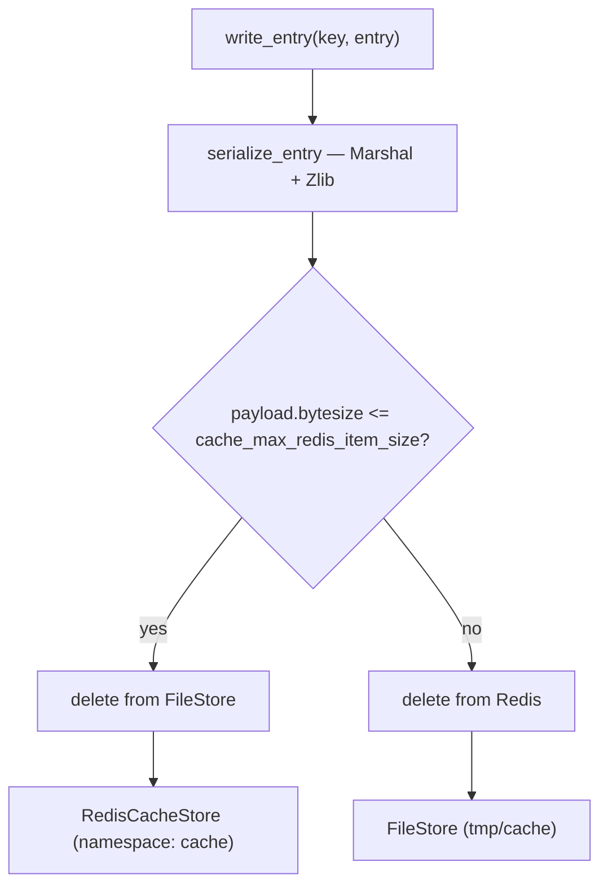

# Caching and Redis

Redis is a **required** part of a SEEK deployment. A single Redis instance backs four separate concerns:

| Concern | Store | Namespace |
|---|---|---|
| `Rails.cache` | `Seek::Caching::RedisWithFileOverflowStore` | `cache` |
| Settings cache | `ActiveSupport::Cache::RedisCacheStore` | `settings-cache` |
| User sessions | `redis_store` session store | `/session` path |
| `Rack::Attack` throttle counters | `ActiveSupport::Cache::RedisCacheStore` | `rack-attack` |

They deliberately share one server and one database (`db 0`), separated by namespace, so that a single authenticated connection URL serves all of them.

---

## The connection URL: `Seek::RedisConfig`

`lib/seek/redis_config.rb` is the single source of truth for the Redis URL. Everything that needs Redis goes through it rather than reading the environment directly — otherwise a password-protected Redis would work for some consumers and silently fail for others.

```ruby
Seek::RedisConfig.url
# => "redis://:s3cr3t@redis_store:6379/0"   (with a password)
# => "redis://redis_store:6379/0"           (without)
```

| Constant / variable | Default |
|---|---|
| `ENV['REDIS_HOST']` | `localhost` |
| `ENV['REDIS_PASSWORD']` | none (auth omitted from the URL) |
| `RedisConfig::PORT` | 6379 |
| `RedisConfig::DB` | 0 |

The password is `CGI.escape`d into the URL's userinfo, so passwords containing URL-special characters work.

**Two loading constraints** make this file plain Ruby rather than idiomatic Rails:

- It is loaded via `require_relative` from `config/environments/*.rb` and `config/initializers/rack_attack.rb`, both of which are evaluated *before* Zeitwerk autoloading is available. It must not reference autoloaded constants.
- It cannot use ActiveSupport core extensions (hence `password.nil? || password.empty?` rather than `password.present?`).

---

## `Rails.cache` — the hybrid overflow store

`Seek::Caching::RedisWithFileOverflowStore` (`lib/seek/caching/redis_with_file_overflow_store.rb`) is an `ActiveSupport::Cache::Store` wrapping **two** backends:



Reads check Redis first and fall through to the FileStore:

```ruby
def read_entry(key, **options)
  entry = @redis_store.send(:read_entry, redis_key, **options)
  return entry if entry

  @file_store.send(:read_entry, file_key, **options)
end
```

### Why a hybrid at all

SEEK caches some genuinely large values — rendered spreadsheet XML, rendered notebook HTML, `rendered_asset_view` output (see [Content Blobs](../content-blobs/)). Pushing multi-megabyte blobs into a memory-bound Redis would evict everything else, including session keys. Small entries get Redis' speed; oversized entries go to disk where size is cheap.

### The threshold is a Proc, not a value

```ruby
new(redis_store: redis_store, file_store: file_store,
    max_redis_item_size: -> { Seek::Config.cache_max_redis_item_size })
```

It is a `Proc` so it re-reads the setting on **every write**, for two reasons: the setting is meant to be tunable from the admin UI without a restart, and reading it eagerly would touch the database while `config/environments/*.rb` is still being evaluated — before `Seek::` constants are even autoloadable.

### Serialize once, then route

`write_entry` serializes the entry itself rather than delegating to whichever backend it picks. If it let the backend serialize, an oversized value would be Marshalled and gzipped twice per write. Serializing first also makes the routing decision exact — the byte size compared against the threshold is precisely the payload stored.

This depends on an **invariant**: this store and both backends must share the same coder and compression settings. `.build` guarantees it by constructing all three with defaults (Marshal + Zlib, 1 KB compress threshold) and exposing no way to pass a custom `:coder` or `:compress`. If a custom coder is ever given to one store and not the others, both the payload reuse and the size comparison break.

### Moving between backends

A stable key's value can grow past, or shrink below, the threshold between writes. Before writing to the chosen backend, the store **deletes the key from the other one**. This is a correctness requirement, not tidiness: leaving a stale copy behind would be harmless only until the fresh copy disappeared (Redis evicting under `allkeys-lru`, or either copy expiring), after which a read would fall through and serve the out-of-date value.

The extra `File.exist?` stat is only paid on a cache **miss**, since writes only happen when `fetch` misses. Steady-state hits return from Redis without touching the filesystem.

### `delete_matched` accepts a Regexp

`RedisCacheStore#delete_matched` only accepts Redis glob strings and raises on anything else, but SEEK has call sites that pass a `Regexp` (matching `FileStore`'s looser behaviour). The store scans Redis by hand and applies the matcher with `String#match?`, which takes either, so both call-site styles work against either backend.

To avoid shipping the whole namespace to the client for filtering, `redis_scan_pattern` extracts the longest leading run of plain-literal characters guaranteed to appear in every matching key and pre-filters server-side with `SCAN MATCH "<prefix>*<literal>*"`. The pattern must be a **superset** of what the matcher accepts — looser is fine, tighter would skip keys that should be deleted — so when no literal can be guaranteed it falls back to scanning the full namespace.

### `clear` and `cleanup`

- **`clear`** clears both backends. `RedisCacheStore#clear` flushes the *entire* Redis instance unless the store is namespaced — which is why `.build` always constructs the Redis backend with `namespace: 'cache'`. Without it, clearing the cache would also wipe sessions and throttle counters.
- **`cleanup`** sweeps only the file side. Redis expires keys natively, and `RedisCacheStore#cleanup` raises `NotImplementedError`.

---

## `CacheOverflowCleanupJob`

Runs daily (`RUN_PERIOD = 1.day`, scheduled at `offset(4)` in `config/schedule.rb`) and does two things:

```ruby
def perform
  Rails.cache.cleanup
  log_redis_memory_stats
end
```

`Rails.cache.cleanup` sweeps expired entries from the FileStore overflow directory. The stats logging is opportunistic — the job is simply an already-scheduled place to record Redis memory figures. Failures to fetch stats are logged and ignored.

See [Background Jobs](../background-jobs/) for the scheduling mechanism.

---

## Monitoring: the eviction trade-off

Sharing one instance between the cache and sessions has a consequence worth understanding: under memory pressure `maxmemory-policy allkeys-lru` evicts keys **instance-wide**, so Redis can discard session keys as readily as cache entries. The user-visible symptom is a silent, early logout.

`redis_memory_stats` exposes the fields that make this visible:

```ruby
REDIS_STAT_FIELDS = %w[used_memory used_memory_human maxmemory_human maxmemory_policy
                       evicted_keys expired_keys keyspace_hits keyspace_misses].freeze
```

- **`evicted_keys` rising** is the signal that Redis is full and discarding keys under the eviction policy. This is the one to watch.
- **`expired_keys`** is included alongside it precisely so the two can be told apart — this is healthy TTL expiry.
- **`keyspace_hits` / `keyspace_misses`** give cache effectiveness.

These are surfaced in two places: the daily `CacheOverflowCleanupJob` log line, and the admin dashboard under **Status and statistics → Redis cache** (`app/views/admin/stats/_redis_stats.html.erb`), which flags a non-zero eviction count with a "memory pressure" label. Counts are cumulative since Redis last started, so watch the trend rather than the absolute number.

---

## The settings cache

`Seek::Config` keeps a cache of the whole `Settings` table, in its **own store and namespace** (`settings-cache`), configured separately from `Rails.cache`:

```ruby
config.settings_cache_store = ActiveSupport::Cache::RedisCacheStore.new(
  url: Seek::RedisConfig.url,
  namespace: 'settings-cache'
)
```

It is a two-level cache: `RequestStore` for the duration of a request, backed by the Redis store with a **one-week** expiry.

```ruby
def self.settings_cache
  RequestStore.fetch(:config_cache) do
    cache_store.fetch(cache_key, expires_in: 1.week) do
      # ... loads Settings.global into a hash
    end
  end
end
```

Caching is only active when `Thread.current[:use_settings_cache]` is set. The `Rack::SettingsCache` middleware (`lib/rack/settings_cache.rb`) enables it for the duration of each request and disables it afterwards, so console sessions and jobs read settings live by default.

While loading the hash, the cache is temporarily disabled to prevent an infinite loop via `attr_encrypted_key_path`.

Because the settings cache lives in its own store, `Rails.cache.clear` does not reach it. `rake seek:clear_cache` therefore clears both:

```ruby
task(clear_cache: :environment) do
  Rails.cache.clear
  Seek::Config.clear_cache   # RequestStore + the settings-cache Redis key
end
```

See [Configuration Settings](../configuration-settings/) for `Seek::Config` itself.

---

## Sessions

Sessions are stored in Redis, on the same database as the cache but under a `/session` path:

```ruby
session_url = "#{Seek::RedisConfig.url}/session"

SEEK::Application.config.session_store(:redis_store,
  servers: [session_url],
  expire_after: 30.minutes,
  key: '_seek_session',
  threadsafe: true,
  same_site: :lax,
  httponly: true
)
```

Redis expires session keys itself, so the old `db:sessions:batch_trim` scheduled task has been removed from `config/schedule.rb` and `RegularMaintenanceJob` no longer sweeps sessions.

---

## `Rack::Attack` throttle counters

`Seek::RackAttackStore` (`lib/seek/rack_attack_store.rb`) builds the store holding throttle counts. It is extracted from the initializer specifically so integration tests can install *exactly* the store the app runs with, rather than a near-copy that could drift from it.

Counters live in Redis so that **all app instances share one count**. An in-process store would count per instance, multiplying the effective limit by the number of web workers and containers.

The store is built with an `error_handler` that logs and returns `nil` rather than raising, so if Redis is unavailable requests are **allowed through** instead of erroring:

```ruby
error_handler: lambda { |method:, returning:, exception:|
  Rails.logger.warn("Rack::Attack Redis cache error in #{method} " \
                    "(returning #{returning.inspect}): #{exception.message}")
}
```

Throttles are only registered in production (`config/initializers/rack_attack.rb`):

| Throttle | Limit | Period | Key |
|---|---|---|---|
| `logins/username` | 10 | 5 minutes | `params['login']` on `POST /session` |
| `logins/ip` | 30 | 1 hour | `req.ip` on `POST /session` |

---

## Configuration

### Setting

| Setting | Default | Description |
|---|---|---|
| `cache_max_redis_item_size` | 1 MB | Size above which a cache entry is written to the filesystem instead of Redis. **Set to 0 to disable Redis caching entirely** and store everything on the filesystem. |

Editable in the admin UI at **/admin/settings**, displayed in KB.

### Environment

| Variable | Default | Purpose |
|---|---|---|
| `REDIS_HOST` | `localhost` | Redis hostname |
| `REDIS_PASSWORD` | — | Password; auth is omitted from the URL when unset |
| `REDIS_MAXMEMORY` | `256mb` | `maxmemory` for the container (read by Docker, not by the app) |

### Per-environment cache store

| Environment | `Rails.cache` | Settings cache |
|---|---|---|
| production | `RedisWithFileOverflowStore` (`tmp/cache`) | Redis, `settings-cache` |
| development | `RedisWithFileOverflowStore` (`tmp/cache/dev-cache`) | Redis, `settings-cache` |
| test | `:memory_store` | `ActiveSupport::Cache::MemoryStore` |

---

## Running Redis in development

Four helper scripts manage a `seek-redis` container (`redis:8.6-alpine`, `seek-redis-data-volume`, `allkeys-lru`, port 6379). They all check that the Docker service is running first.

```bash
script/start-docker-redis.sh    # create the volume if needed, start the container
script/stop-docker-redis.sh     # stop and remove the container, keep the volume
script/reset-docker-redis.sh    # drop the volume, recreate it, restart
script/delete-docker-redis.sh   # remove the container and the volume
```

The dev container is deliberately **not** password-protected, so `Seek::RedisConfig.url` resolves to `redis://localhost:6379/0` with no extra environment.

For a Compose deployment, Redis is the `redis_store` service — see [Docker Setup](../docker/).

---

## Testing

Unit and functional tests use `:memory_store` for both caches, so they need no Redis server.

- **Unit tests** for the overflow store run against [`mock_redis`](https://github.com/sds/mock_redis) (in the `test` group of the `Gemfile`).
- **Integration tests** swap in the real `Seek::RackAttackStore` in an `ActionDispatch::IntegrationTest` `setup` block, so the full stack is exercised against the store the app actually runs with. They clear throttle counters between tests to avoid leakage. CI provides a Redis service for this.

See [Testing Setup](../testing-setup/).

---

## Key Files

| File | Purpose |
|---|---|
| `lib/seek/redis_config.rb` | Single source of truth for the Redis URL |
| `lib/seek/caching/redis_with_file_overflow_store.rb` | The hybrid Redis/FileStore cache |
| `lib/seek/rack_attack_store.rb` | Builds the throttle counter store |
| `lib/rack/settings_cache.rb` | Middleware enabling the settings cache per request |
| `config/initializers/session_store.rb` | Redis session store configuration |
| `config/initializers/rack_attack.rb` | Throttle store selection and throttle rules |
| `config/environments/production.rb` / `development.rb` | `cache_store` and `settings_cache_store` wiring |
| `app/jobs/cache_overflow_cleanup_job.rb` | Daily FileStore sweep and Redis stats logging |
| `app/views/admin/stats/_redis_stats.html.erb` | Admin dashboard Redis panel |
| `docker/redis.env` | Redis host, password and memory limit for Compose |
| `script/*-docker-redis.sh` | Development container helpers |
