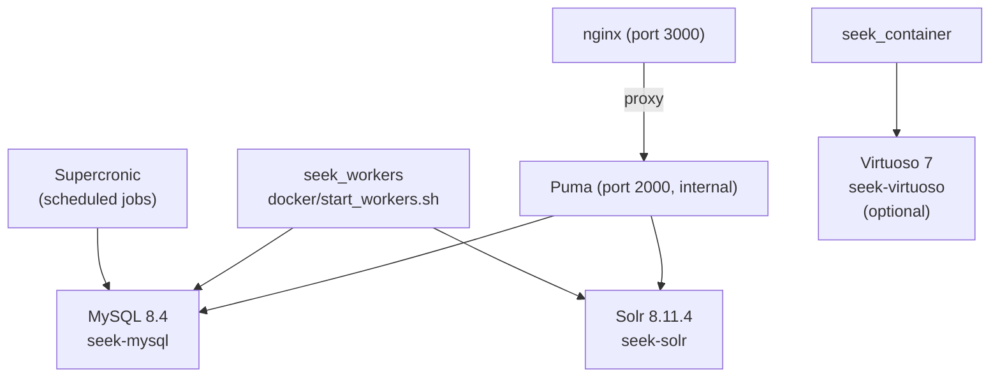
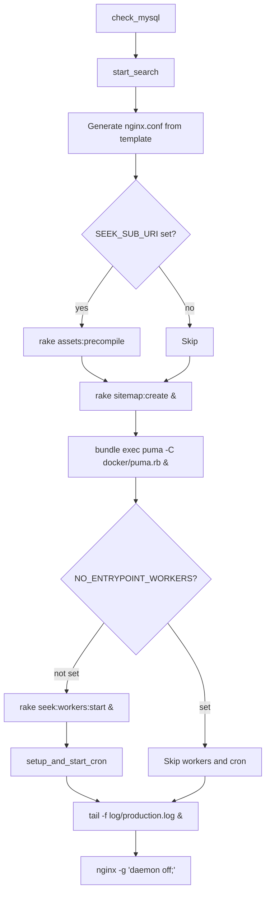

# Docker Setup

SEEK ships a production-grade Docker configuration built around a multi-stage `Dockerfile`, an orchestrated `docker-compose.yml`, and a set of shell scripts that handle startup, database initialisation, and process management.

All Docker-related files live in `docker/`, with the `Dockerfile` and `docker-compose*.yml` files at the project root.

---

## Container Architecture



The `seek` container runs nginx + Puma in the same process group. Workers run in a separate `seek_workers` container sharing the same image. Solr and MySQL are independent services.

---

## Dockerfile

`Dockerfile` uses a three-stage build to keep the runtime image lean.

### Stage 1: `base`

Base image: `ruby:3.3-slim-trixie`

Installs runtime OS packages that must be present at both build and run time:

```
curl, default-mysql-client, gettext, git, graphviz,
libjemalloc2, libreoffice, libvips, links, locales,
nodejs, openjdk-21-jre, poppler-utils, postgresql-client,
python<version>, shared-mime-info, sqlite3, vim-tiny, zip
```

Key environment variables set here and inherited by later stages:

| Variable | Value |
|---|---|
| `APP_DIR` | `/seek` |
| `RAILS_ENV` | `production` |
| `BUNDLE_PATH` | `/usr/local/bundle` |
| `BUNDLE_WITHOUT` | `development` |
| `LANG` | `en_US.UTF-8` (required by some gems) |

The Python version to install is read from `.python-version` at build time, so bumping the Python version only requires updating that file.

### Stage 2: `builder`

Adds build-only packages (compilers, dev headers) to the base, then:

1. Creates a Python virtualenv at `/opt/venv` and installs `requirements.txt`
2. Copies all app code
3. Bundles Ruby gems with `--frozen --deployment --without development test`
4. Downloads and SHA1-verifies [Supercronic](https://github.com/aptible/supercronic) (cron runner)
5. Copies `docker/virtuoso_settings.docker.yml` → `config/virtuoso_settings.yml`
6. Touches `config/using-docker` so the app knows it is containerised
7. Installs a SQLite database config (`docker/database.docker.sqlite3.yml`) for asset compilation
8. Runs `rake db:setup` against that SQLite database (populates seeds into a throwaway DB)
9. Runs `rake assets:precompile` — bundles JS/CSS into `public/assets`

Build tools are **not** copied to the runtime stage, keeping the final image significantly smaller.

### Stage 3: `runtime`

Starts fresh from the `base` stage (no build tools), then:

1. Installs nginx
2. Copies from `builder`: bundled gems (`BUNDLE_PATH`), the full app (`APP_DIR`), the Python virtualenv (`/opt/venv`), and the Supercronic binary
3. Runs as `www-data`
4. Exposes port **3000**
5. Declares volumes: `/seek/filestore`, `/seek/sqlite3-db`, `/seek/tmp/cache`, `/seek/public/assets`
6. Sets `CMD ["docker/entrypoint.sh"]`

---

## Entrypoint: `docker/entrypoint.sh`

The main container entry point. Runs sequentially — each step must succeed before the next begins.



### `NO_ENTRYPOINT_WORKERS`

Set to `1` in `docker-compose.yml` for the `seek` container. This prevents the main container from starting delayed job workers, leaving that to the dedicated `seek_workers` container. Unset it only when running a single all-in-one container without `docker-compose`.

### nginx config generation

`docker/nginx.conf.template` is processed by `envsubst` with two variables:

- `SEEK_LOCATION` — the full path prefix (e.g. `/` or `/seek/`)
- `SEEK_SUB_URI` — same but without the trailing slash (used for nginx `location` blocks)

These are derived from `RAILS_RELATIVE_URL_ROOT`. If that env var is not set, the app is served at `/`.

When `SEEK_SUB_URI` is non-empty, `assets:precompile` runs again at startup to bake the sub-path into the asset URLs — this is why the relative-root variant needs the `seek-assets` volume.

---

## Workers: `docker/start_workers.sh`

Runs in the `seek_workers` container. Mirrors the entrypoint but skips nginx and Puma:

1. Copies MySQL database config
2. Waits for MySQL (`wait_for_mysql`)
3. Waits for the `users` table to exist (`wait_for_database`) — ensures the `seek` container has finished `db:setup` first
4. Calls `start_search`
5. Calls `setup_and_start_cron`
6. Runs `bundle exec rake seek:workers:start` (blocking)

---

## Shared Functions: `docker/shared_functions.sh`

Sourced by both `entrypoint.sh` and `start_workers.sh`.

| Function | Purpose |
|---|---|
| `wait_for_mysql` | Polls `mysqladmin ping` until MySQL responds |
| `wait_for_database` | Polls `DESC users` until the schema is ready |
| `set_default_mysql_host` | Defaults `MYSQL_HOST` to `db` if unset |
| `use_mysql_db` | Copies `docker/database.docker.mysql.yml` → `config/database.yml` |
| `check_mysql` | Runs `use_mysql_db`, `wait_for_mysql`, and `rake db:setup` if the DB is empty |
| `enable_search` | Copies `docker/seek_local_search_enabled.rb` to `config/initializers/` |
| `start_search` | Calls `enable_search` if `SOLR_PORT` is set; logs a warning otherwise |
| `setup_and_start_cron` | Generates `/seek/seek.crontab` via `whenever`, then starts Supercronic |

`start_search` is opt-in: if `SOLR_PORT` is not set (single-container mode without a Solr service), Solr stays disabled and no initializer is written.

---

## Docker Compose Files

### `docker-compose.yml` — standard setup

The default configuration. All four services share a base YAML anchor (`seek_base`) for the image name and common environment.

**Services:**

| Service | Container | Image | Port |
|---|---|---|---|
| `db` | `seek-mysql` | `mysql:8.4` | (internal) |
| `seek` | `seek` | `fairdom/seek:1.18-dev` | `3000:3000` |
| `seek_workers` | `seek-workers` | `fairdom/seek:1.18-dev` | (none) |
| `solr` | `seek-solr` | `solr:8.11.4` | (internal) |

**MySQL** is configured with `utf8mb4` charset and collation. Health check: `mysqladmin ping` every 10 s, starting after 20 s, 90 s graceful shutdown.

**seek** depends on `db` (healthy) and `solr` (healthy). Health check: `curl http://localhost:3000/up`.

**seek_workers** uses `QUIET_SUPERCRONIC=1` to suppress cron log noise. Health check: `script/check_worker_pids.sh`.

**solr** mounts `./solr/seek/conf` read-only into the container as the Solr configset and uses `solr-precreate seek` to initialise the `seek` core on first start.

**External volumes** (must be created before first `docker-compose up`):

```bash
docker volume create seek-filestore
docker volume create seek-mysql-db
docker volume create seek-solr-data
docker volume create seek-cache
```

### `docker-compose-virtuoso.yml` — with RDF triple store

Identical to the standard compose but adds a `virtuoso` service (Virtuoso 7.2.15) for RDF/SPARQL support. The `seek` and `seek_workers` services gain `docker/virtuoso.env` as an additional env file.

`DBA_PASSWORD` in `docker/virtuoso.env` must be changed from the default `CHANGE_ME` before deploying. The same password must be set in `config/virtuoso_settings.yml` (generated from `docker/virtuoso_settings.docker.yml` during the build).

Note: `virtuoso` uses `condition: service_started` rather than a health check, so SEEK will start as soon as Virtuoso's container is up, not necessarily when it is ready.

### `docker-compose-relative-root.yml` — sub-path deployment

Use when SEEK must be served under a path prefix (e.g. `https://example.org/seek`). Sets `RAILS_RELATIVE_URL_ROOT: '/seek'`. The entrypoint detects this and re-runs `assets:precompile` at startup. Adds a `seek-assets` external volume for the compiled assets.

### `docker-compose.build.yml` — local build

Minimal override that replaces `image: fairdom/seek:...` with `build: .`. Useful for building a local image rather than pulling from Docker Hub:

```bash
docker compose -f docker-compose.yml -f docker-compose.build.yml up --build
```

---

## Key Configuration Files

### `docker/puma.rb` — app server

- Binds to `tcp://0.0.0.0:2000` (nginx proxies from port 3000)
- Workers: one per CPU core (`Concurrent.processor_count`)
- Threads: 1 min / 1 max per worker
- Preloads app for copy-on-write efficiency
- Worker timeout: 120 s
- Logs to `log/puma.out` / `log/puma.err`

### `docker/nginx.conf.template` — reverse proxy

- Accepts on port **3000**, proxies to Puma on `127.0.0.1:2000`
- Max upload body: **50 GB**
- Proxy read/send timeout: 300 s
- Static files served directly from `/seek/public`
- `/assets/` served with `Cache-Control: max-age` and `gzip_static`
- Uses `${SEEK_LOCATION}` and `${SEEK_SUB_URI}` placeholders, filled by `envsubst` at startup

### `docker/database.docker.mysql.yml` — MySQL adapter config

Used at runtime (copied to `config/database.yml` by `use_mysql_db`). Credentials come from `docker/db.env` via environment variables.

### `docker/database.docker.sqlite3.yml` — SQLite adapter config

Used during the Docker build only, so `rake db:setup` and `rake assets:precompile` can run without a running MySQL instance. The resulting SQLite file is not used in production.

### `docker/seek_local_search_enabled.rb` — Solr initializer

Copied to `config/initializers/` by `enable_search`. Contains:

```ruby
Seek::Config.default :solr_enabled, true
```

### `config/using-docker`

An empty file touched during the build (`RUN touch config/using-docker`). Application code can check `File.exist?(Rails.root.join('config/using-docker'))` to detect a containerised environment.

---

## Environment Variables

| Variable | Default | Purpose |
|---|---|---|
| `RAILS_ENV` | `production` | Rails environment |
| `MYSQL_HOST` | `db` | MySQL hostname |
| `MYSQL_DATABASE` | — | Triggers MySQL mode; if unset, SQLite is used |
| `MYSQL_USER` | — | MySQL user |
| `MYSQL_PASSWORD` | — | MySQL password |
| `SOLR_HOST` | — | Solr hostname |
| `SOLR_PORT` | — | Enables Solr; if unset, search is disabled |
| `RAILS_RELATIVE_URL_ROOT` | — | Sub-path prefix (e.g. `/seek`) |
| `NO_ENTRYPOINT_WORKERS` | — | Set to `1` to skip starting workers in the main container |
| `QUIET_SUPERCRONIC` | — | Set to `1` to suppress Supercronic log output |
| `OPENBIS_USERNAME` | — | If set, seeds a default openBIS endpoint (OpenSEEK only) |

---

## Upgrades

`docker/upgrade.sh` is a utility script for in-place upgrades of a running container. It calls `bundle exec rake seek:upgrade` after confirming the database is available. Typically run via `docker exec` against a stopped-workers state.
