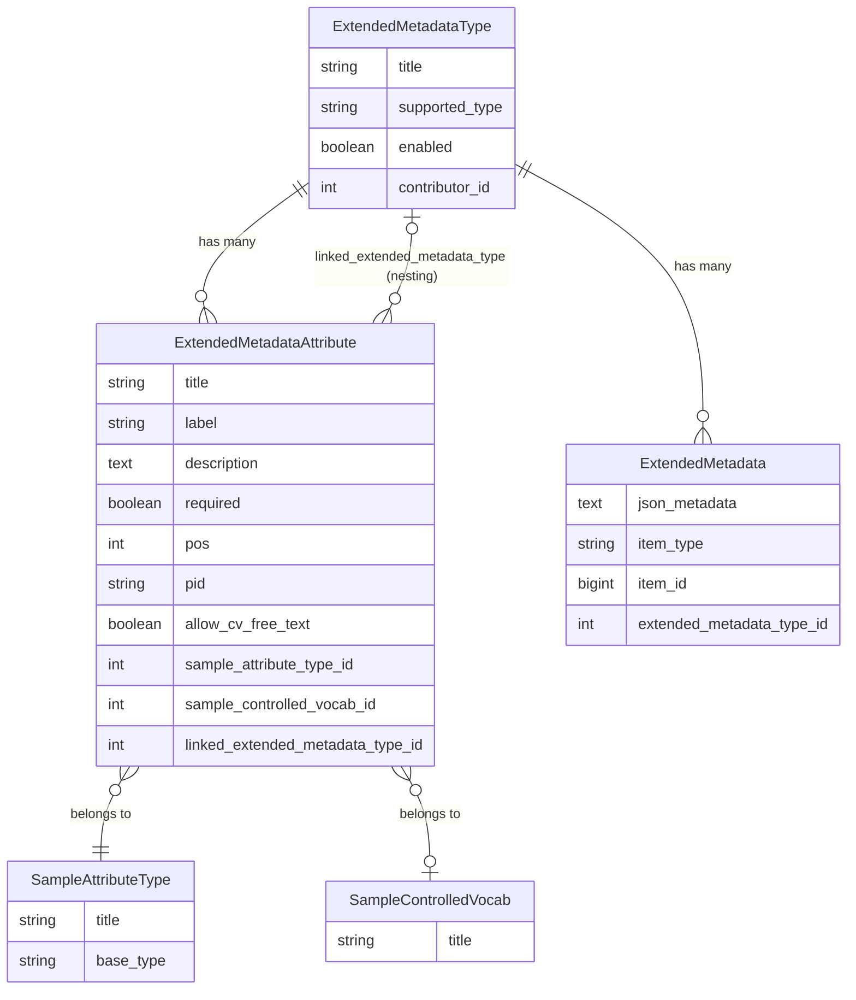
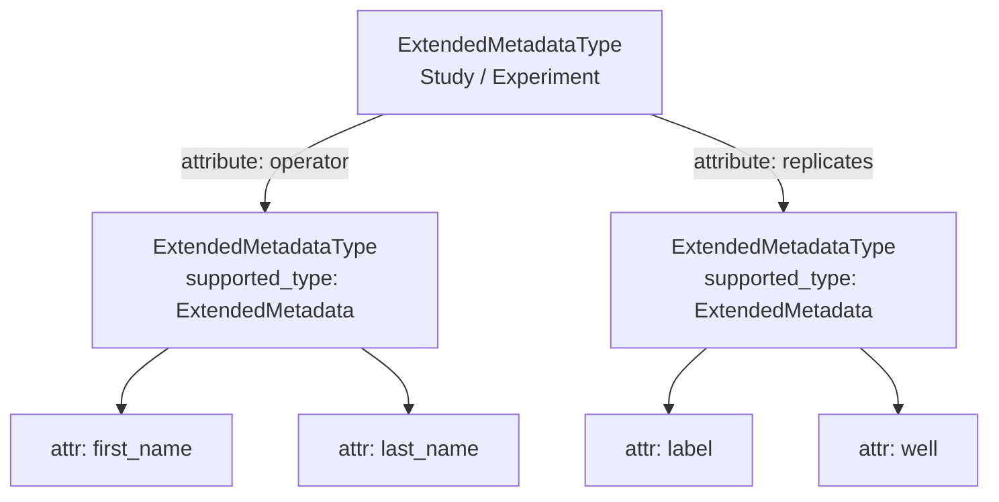
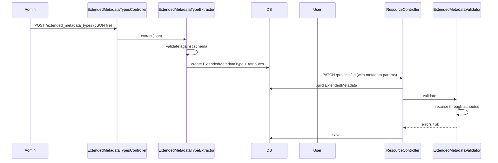

Extended Metadata lets SEEK administrators attach structured, typed, and validated extra fields to supported resources without schema migrations. The system is built on three core models.

The type registry (`SampleAttributeType`), controlled vocabulary infrastructure (`SampleControlledVocab`), and JSON serialisation layer (`Seek::JSONMetadata`) are shared with the Sample system. For a detailed comparison and the cross-system linking mechanism see [Samples and Sample Types](samples).

## Core models



### `ExtendedMetadataType`

The schema definition — a named template scoped to one resource type via `supported_type` (e.g. `"Study"`, `"Project"`). A type marked `enabled: false` still exists in the database but cannot be used for new records.

`app/models/extended_metadata_type.rb`

### `ExtendedMetadataAttribute`

One field within a type. It references a `SampleAttributeType` (the data type), and optionally a `SampleControlledVocab` or another `ExtendedMetadataType` (for nesting). The `pid` field stores a persistent identifier such as an ontology URI.

`app/models/extended_metadata_attribute.rb`

### `ExtendedMetadata`

One instance of filled-in metadata, attached to a resource via a polymorphic `item` association. All field values are serialised together into the `json_metadata` text column.

`app/models/extended_metadata.rb`

## Supported resource types

`has_extended_metadata` sets up the `has_one :extended_metadata` association and search indexing. It is called in three places:

- `lib/seek/acts_as_isa.rb` — picked up by all ISA models
- `lib/seek/acts_as_asset.rb` — picked up by all asset models
- Explicitly in `Event`, `ObservationUnit`, and `Project`

The `supported_type` string in an `ExtendedMetadataType` record must match the class name exactly.

**ISA** (`acts_as_isa`)

| Model | `supported_type` |
|---|---|
| `Investigation` | `"Investigation"` |
| `Study` | `"Study"` |
| `Assay` | `"Assay"` |

**Assets** (`acts_as_asset`)

| Model | `supported_type` |
|---|---|
| `Collection` | `"Collection"` |
| `DataFile` | `"DataFile"` |
| `Document` | `"Document"` |
| `FileTemplate` | `"FileTemplate"` |
| `Model` | `"Model"` |
| `Placeholder` | `"Placeholder"` |
| `Presentation` | `"Presentation"` |
| `Publication` | `"Publication"` |
| `Sample` | `"Sample"` |
| `SampleType` | `"SampleType"` |
| `Sop` | `"Sop"` |
| `Template` | `"Template"` |
| `Workflow` | `"Workflow"` |

**Other**

| Model | `supported_type` |
|---|---|
| `Event` | `"Event"` |
| `ObservationUnit` | `"ObservationUnit"` |
| `Project` | `"Project"` |

`supported_type: "ExtendedMetadata"` is the special value used for nested types (see below).

To check at runtime whether a class supports extended metadata:

```ruby
Study.supports_extended_metadata?       # => true
SomeOtherModel.supports_extended_metadata?  # => false (no association)
```

## Data storage

All field values for one `ExtendedMetadata` record are stored in a single `json_metadata` text column as a JSON object keyed by attribute title:

```json
{
  "protocol_name": "Sample Prep v2",
  "temperature": 37,
  "start_date": "2024-03-01",
  "operator": {
    "first_name": "Jane",
    "last_name": "Smith"
  },
  "replicates": [
    { "label": "rep_1", "well": "A1" },
    { "label": "rep_2", "well": "A2" }
  ]
}
```

Access and mutation go through `Seek::JSONMetadata::Serialization` and `Seek::JSONMetadata::Data`:

```ruby
em = resource.extended_metadata

em.get_attribute_value('protocol_name')   # => "Sample Prep v2"
em.set_attribute_value('temperature', 42)

em.data['operator']                       # => { "first_name" => "Jane", ... }
em.data.extract_all_values                # flat array used for search indexing
```

`lib/seek/json_metadata/serialization.rb`, `lib/seek/json_metadata/data.rb`

## Nesting

An attribute whose `SampleAttributeType` is `LinkedExtendedMetadata` or `LinkedExtendedMetadataMulti` embeds another `ExtendedMetadataType` inline. The nested type must have `supported_type: "ExtendedMetadata"`.



`LinkedExtendedMetadata` stores a single object; `LinkedExtendedMetadataMulti` stores an array of objects.

## Validation

`ExtendedMetadataValidator` (`app/validators/extended_metadata_validator.rb`) runs on save:

1. Each attribute value is validated by its `SampleAttributeType` handler
2. CV attributes check the value exists in `SampleControlledVocab` (or allow free text if `allow_cv_free_text: true`)
3. Required attributes must be non-blank
4. Linked attributes recurse — nested objects are validated against their own `ExtendedMetadataType`
5. A record cannot be created with a disabled `ExtendedMetadataType`

## Full data flow


