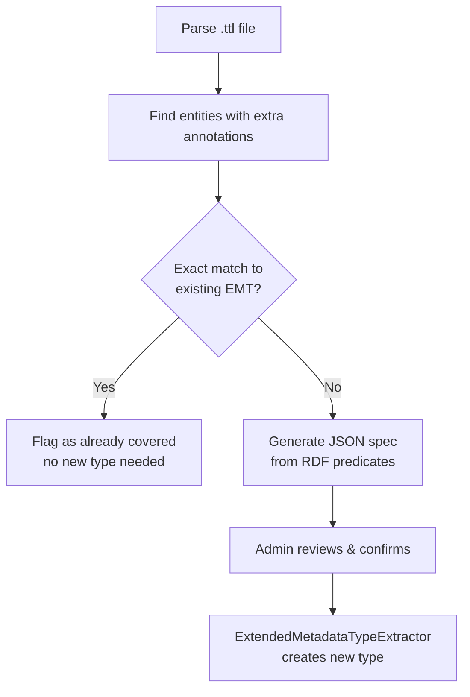

There are three ways to create an `ExtendedMetadataType`. All three ultimately produce the same database records; they differ in who initiates the process and where the definition comes from.

| Method | Initiated by | Source |
|---|---|---|
| [Seed / Ruby code](../extended-metadata-in-code/) | Developer | Ruby code in `db/seeds/` |
| JSON file upload | Admin (UI) | Hand-crafted `.json` file |
| FAIR Data Station turtle import | Admin (UI) | `.ttl` file from a FAIR Data Station export |

---

## JSON file upload

An admin uploads a `.json` file via **Admin → Extended Metadata Types → New**. The file is parsed and validated by `ExtendedMetadataTypeExtractor`, then saved directly.

`lib/seek/extended_metadata_type/extended_metadata_type_extractor.rb`

### File structure

The JSON must pass the JSON Schema at `lib/seek/extended_metadata_type/extended_metadata_type_schema.json`. The top-level fields are all required:

```json
{
  "title": "Experiment Protocol",
  "supported_type": "Study",
  "enabled": true,
  "attributes": [ ... ]
}
```

`additionalProperties: false` is enforced — unknown top-level keys are rejected.

### Attribute objects

There are two shapes depending on whether the type needs an external reference (`ID`).

**Simple types** (String, Integer, Float, Boolean, Date, DateTime, Text, Seek resource links)

```json
{
  "title": "protocol_name",
  "type": "String",
  "label": "Protocol name",
  "description": "The name of the experimental protocol used.",
  "required": true,
  "pid": "http://purl.obolibrary.org/obo/OBI_0000272",
  "pos": 1
}
```

Required fields: `title`, `type`. All others are optional.

**Reference types** (Controlled Vocabulary, CV List, Linked Extended Metadata, Linked Multi)

```json
{
  "title": "status",
  "type": "Controlled Vocabulary",
  "ID": 7,
  "required": true,
  "allow_cv_free_text": false,
  "pos": 2
}
```

```json
{
  "title": "operator",
  "type": "Linked Extended Metadata",
  "ID": 14,
  "required": false,
  "pos": 3
}
```

Required fields: `title`, `type`, `ID`. The `ID` value is the database ID of the `SampleControlledVocab` or `ExtendedMetadataType` to link.

### Valid `type` values

```
String · Text · Integer · Float · Boolean · Date · DateTime
Seek Strain · Seek Sample · Seek Sample (multiple)
Seek Data file · Seek SOP
Controlled Vocabulary · Controlled Vocabulary List
Linked Extended Metadata · Linked Extended Metadata (multiple)
```

### Complete example

```json
{
  "title": "Experiment Protocol",
  "supported_type": "Study",
  "enabled": true,
  "attributes": [
    {
      "title": "protocol_name",
      "type": "String",
      "label": "Protocol name",
      "required": true,
      "pid": "http://purl.obolibrary.org/obo/OBI_0000272",
      "pos": 1
    },
    {
      "title": "replicate_count",
      "type": "Integer",
      "required": false,
      "pos": 2
    },
    {
      "title": "status",
      "type": "Controlled Vocabulary",
      "ID": 7,
      "required": true,
      "pos": 3
    },
    {
      "title": "operator",
      "type": "Linked Extended Metadata",
      "ID": 14,
      "description": "The person who ran the experiment.",
      "required": false,
      "pos": 4
    }
  ]
}
```

### Using the extractor in code

The same extractor used by the controller can be called directly — useful for testing or scripted imports:

```ruby
json_string = File.read('my_type.json')
emt = Seek::ExtendedMetadataType::ExtendedMetadataTypeExtractor
        .extract_extended_metadata_type(StringIO.new(json_string))
emt.save!
```

---

## FAIR Data Station turtle import

When a FAIR Data Station experiment is imported into SEEK via a Turtle (`.ttl`) file, the system automatically matches RDF annotations to existing Extended Metadata Types, or offers to create new types from the annotations it finds.

The process runs in two phases:

### Phase 1: candidate discovery

`Seek::FairDataStation::Reader#candidates_for_extended_metadata` parses the RDF graph and returns the ISA entities (Investigation, Study, ObservationUnit, Assay) that have "additional annotations" — RDF predicates that are not part of the standard JERM ontology.

```ruby
reader = Seek::FairDataStation::Reader.new
candidates = reader.candidates_for_extended_metadata('/path/to/export.ttl')
```

### Phase 2: type matching

For each candidate entity, the system tries to find an existing `ExtendedMetadataType` whose attribute `pid` values match the RDF predicate URIs in the turtle file.



**Exact match** (`find_exact_matching_extended_metadata_type`): an existing type whose attribute PIDs are a 100% match for the annotation predicates, with no extras on either side.

**Closest match** (`find_closest_matching_extended_metadata_type`): if no exact match, the type with the highest overlap is used when populating values. Required attributes with no matching predicate in the file cause the candidate to be skipped.

`lib/seek/fair_data_station/base.rb`

### Generating a new type from RDF

When no exact match exists, `to_extended_metadata_type_json` builds the JSON spec from the annotation predicates. All attributes default to type `String`; the `pid` is set from the predicate URI:

```json
{
  "title": "FDS study - <package_name>",
  "supported_type": "Study",
  "enabled": true,
  "attributes": [
    { "title": "Temperature", "type": "String", "pid": "http://example.org/temperature", "required": false },
    { "title": "pH",          "type": "String", "pid": "http://example.org/pH",          "required": false }
  ]
}
```

The admin reviews the proposed JSON on the confirmation screen (controller action `create_from_fair_ds_ttl`), adjusts titles if needed, then submits. The `submit_jsons` action passes each JSON through `ExtendedMetadataTypeExtractor` and saves the results.

### Populating values at import time

Once an `ExtendedMetadataType` is matched or created, the writer (`lib/seek/fair_data_station/writer.rb`) calls `populate_extended_metadata` on each entity. This walks the annotation predicates, looks up the matching attribute by `pid`, and writes the value into `json_metadata`. Nested types are handled recursively.

```
RDF predicate URI  →  ExtendedMetadataAttribute.pid  →  json_metadata key
```

The `pid` field on `ExtendedMetadataAttribute` is therefore the critical link between RDF annotations and stored metadata values. Any type intended for FAIR Data Station import should have `pid` set on every attribute.
