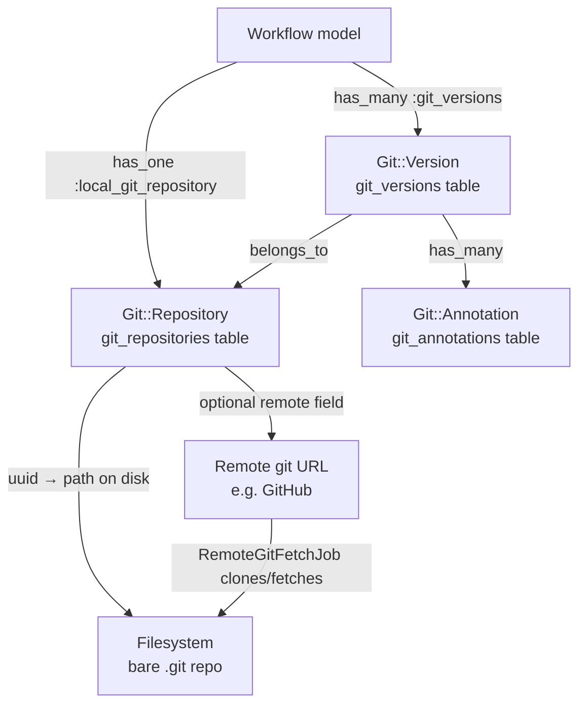
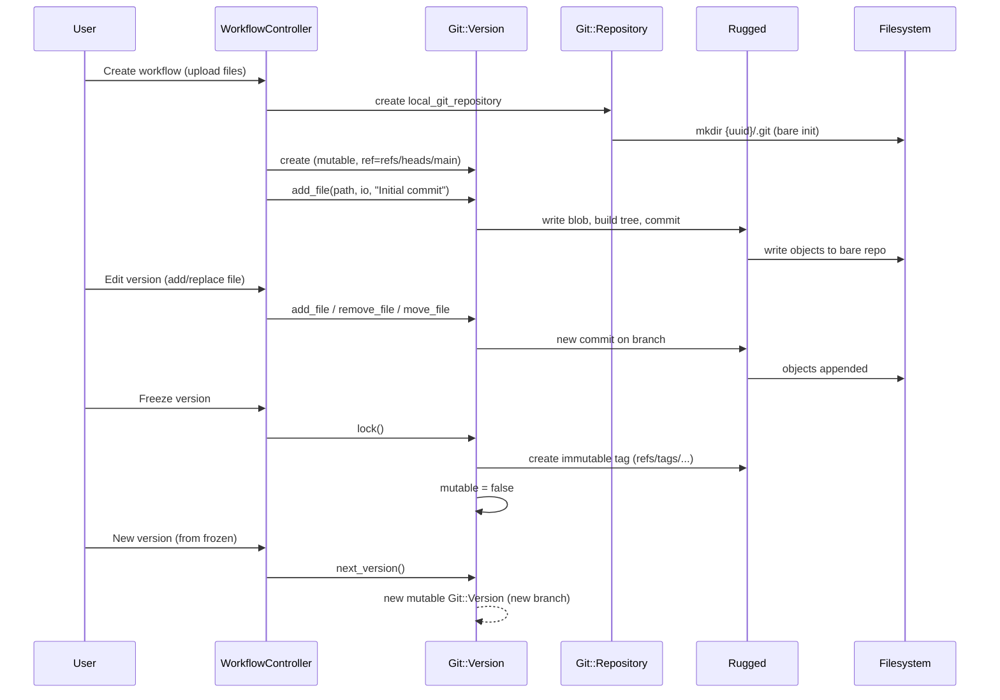
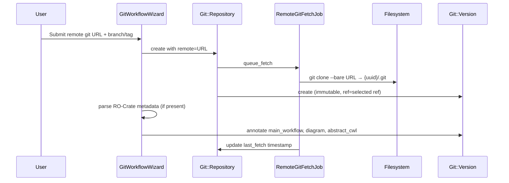
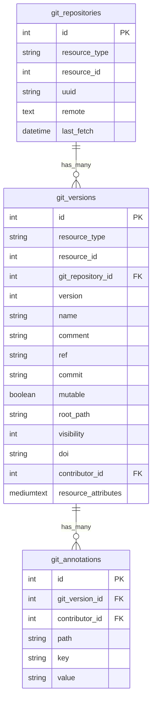
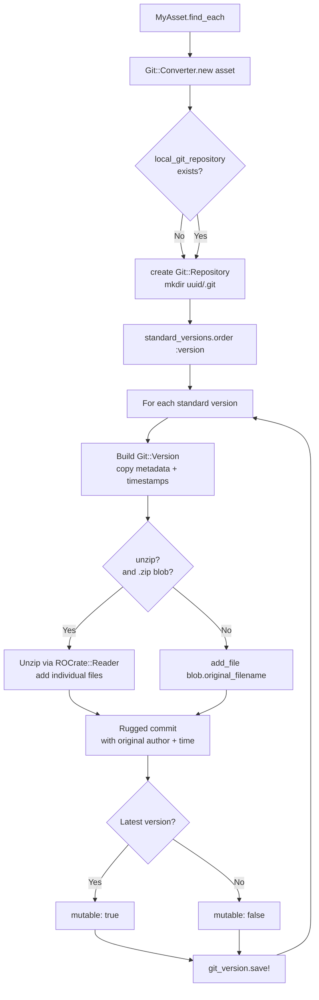

# Git Backend Developer Documentation

FAIRDOM-SEEK uses a git-based versioning system for Workflows (and any future assets that opt in). Each resource gets a local bare git repository on disk, with git commits tracking file changes. Versions are references (branches or tags) into that repository, and metadata (annotations, visibility, DOI) is stored in database records alongside the git history.

---

## High-Level Architecture



---

## Core Classes

### `Git::Repository` (`app/models/git/repository.rb`)

Represents the git repository for a resource. One repository per resource (polymorphic `resource_type` / `resource_id`). Wraps a Rugged::Repository.

Key responsibilities:
- Tracks whether the repo has a remote URL (`remote` column)
- Exposes `local_path` → `{git_filestore_path}/{uuid}/.git`
- `git_base` → returns a `Rugged::Repository` instance
- `resolve_ref(ref)` → returns commit SHA for a branch or tag name
- `remote_refs` → returns metadata for all refs (for the "import from remote" UI)
- `fetch` / `queue_fetch` → triggers `RemoteGitFetchJob` for remote repos

### `Git::Version` (`app/models/git/version.rb`)

One row per version of the resource. Combines a git ref/commit with metadata. Includes `Git::Operations` for all file-level work.

Key columns:

| Column | Purpose |
|---|---|
| `ref` | Git reference, e.g. `refs/heads/main`, `refs/tags/v1.0` |
| `commit` | Resolved commit SHA (set on save) |
| `mutable` | `true` = editable; `false` = frozen |
| `visibility` | `:public`, `:registered_users`, or `:private` |
| `root_path` | Optional subdirectory within the repo to treat as root |
| `resource_attributes` | JSON snapshot of parent resource attributes at this version |
| `doi` | DOI minted for this version (frozen versions only) |

Key methods:
- `lock` — creates an immutable git tag and sets `mutable = false`
- `next_version` — creates a new mutable version branching from this one
- `add_file(path, io, message)`, `remove_file`, `move_file` — file operations via `Git::Operations`
- `get_blob(path)` / `get_tree(path)` — access files and directories
- `ro_crate?` — returns true if repo contains `ro-crate-metadata.json(ld)`

### `Git::Blob` (`app/models/git/blob.rb`)

Represents a single file within a git version. Wraps a Rugged blob. Handles both locally-committed content and external remote files (registered via `remote_source` annotation).

- `file_contents(as_text, fetch_remote)` — reads content; optionally fetches remote URLs
- `remote?` / `fetched?` — status of externally-referenced files
- `annotations` — returns annotation records for this path

### `Git::Tree` (`app/models/git/tree.rb`)

Represents a directory within a git version. Provides `blobs`, `trees`, `walk_blobs`, `walk_trees`, and `total_size`.

### `Git::Annotation` (`app/models/git/annotation.rb`)

Key/value metadata attached to a file path within a specific `Git::Version`. Used to mark special files.

Built-in annotation keys used for Workflows:

| Key | Purpose |
|---|---|
| `main_workflow` | Path of the primary workflow file |
| `diagram` | Path of the workflow diagram image |
| `abstract_cwl` | Path of the abstract CWL description |
| `remote_source` | External URL for a file (content fetched separately) |

---

## Module Breakdown

### `Git::Versioning` (`lib/seek/git/versioning.rb` / `lib/git/versioning.rb`)

Class-level DSL. Call `git_versioning(options) { ... }` in a model class to enable git versioning. This:
- Creates a nested `ModelName::Git::Version` class (e.g. `Workflow::Git::Version`)
- Adds `has_many :git_versions` and `has_one :local_git_repository` to the model
- Adds `git_version`, `latest_git_version`, `find_git_version`, `save_as_new_git_version` instance methods
- Accepts `sync_ignore_columns:` — attributes excluded from the JSON snapshot (e.g. `test_status` for Workflow)

### `Git::Operations` (`lib/git/operations.rb`)

Included into `Git::Version`. All file-manipulation and tree-navigation methods live here. Uses Rugged directly to create commits, write blobs, and build trees. Key internals:
- `perform_commit(tree_oid, message)` — low-level commit creation via Rugged
- `object(path)` — resolves a path within the repo to a Rugged object
- `in_dir` / `in_temp_dir` — checks out the version into a temporary directory for operations that need a working tree

### `Git::VersioningCompatibility` (`lib/git/versioning_compatibility.rb`)

Adapter that lets the rest of the codebase treat git-versioned and traditionally-versioned resources identically. Methods like `versions`, `version`, `latest_version` delegate to either `git_versions` or `standard_versions` based on `is_git_versioned?`.

### `Git::DoiCompatibility` (`lib/git/doi_compatibility.rb`)

Adapter that maps DOI minting onto the git versioning system so the existing DOI infrastructure works for frozen git versions.

### `Git::Converter` (`lib/git/converter.rb`)

One-way migration tool. Converts a resource that was using the traditional ContentBlob versioning system to the git backend. Creates a `Git::Version` for each existing version, importing file content and preserving metadata. Used when upgrading existing Workflow records.

---

## Lifecycle of a Workflow Version



---

## Remote Repository Flow



Remote versions are always immutable (`mutable: false`) since they are snapshots of an external repo at a point in time.

---

## File Storage

```
{Seek::Config.git_filestore_path}/
└── {uuid}/
    └── .git/          ← bare git repository (Rugged operates directly here)
        ├── HEAD
        ├── objects/
        ├── refs/
        └── ...
```

The `uuid` is generated when the `Git::Repository` record is first created. The path is derived at runtime from `Seek::Config.git_filestore_path` (a configurable admin setting), so it can be on any mount.

---

## Database Schema



---

## Authorization and Visibility

`Git::Version` has its own `visibility` field independent of the parent resource's policy:

- `:public` — anyone (including non-logged-in users)
- `:registered_users` — logged-in SEEK members
- `:private` — only resource managers

The parent resource's `PolicyBasedAuthorization` still gates overall access; version visibility is an additional layer applied per-version. Frozen versions with a minted DOI cannot have their visibility downgraded.

`GitController` enforces:
- Read operations: parent resource must be `downloadable?` by the current user
- Write/edit operations: parent resource must be `can_edit?` by the current user
- Frozen versions raise `Git::ImmutableVersionException` on any write attempt

---

## Background Jobs

| Job | Queue | Purpose |
|---|---|---|
| `RemoteGitFetchJob` | `REMOTE_CONTENT` | Clones or fetches a remote git URL into the local bare repo; updates `last_fetch` |
| `RemoteGitContentFetchingJob` | `REMOTE_CONTENT` | Downloads the actual byte content for files registered with a `remote_source` annotation; retries up to 3× |

---

## Enabling Git Versioning on a Model

Only `Workflow` currently uses git versioning, but the mechanism is generic. This section covers everything needed to wire it up on a new model and migrate any existing content-blob versions.

### Prerequisites

Git support must be enabled in SEEK's admin settings. It is off by default:

```ruby
# config/initializers/seek_configuration.rb
Seek::Config.default :git_support_enabled, false
```

Enable it via the SEEK admin UI or by setting `git_support_enabled` to `true` in `db/seeds/` / `seek_settings`. Once enabled, the `after_create :save_git_version_on_create` callback fires for new records.

The git filestore lives at `Seek::Config.git_filestore_path`, which resolves to `{filestore_path}/git/`. Ensure this directory exists and is writable before running any migration.

### 1. Call `git_versioning` in the model

`lib/git/versioning.rb` defines the `git_versioning` class macro. Call it inside your model, before or after `acts_as_asset` (order does not matter):

```ruby
class MyAsset < ApplicationRecord
  acts_as_asset

  git_versioning(sync_ignore_columns: ['some_transient_column']) do
    # This block is class_eval'd on the generated MyAsset::Git::Version class.
    # Add callbacks, validations, or methods specific to this asset's versions here.
    # See Workflow for a real example (WorkflowExtraction, DOI minting, etc.)
  end
end
```

`git_versioning` is idempotent — a second call is silently ignored.

**What it wires up:**

| Added to the model | Purpose |
|---|---|
| `has_one :local_git_repository` | The bare git repo on disk |
| `has_many :git_versions` | All version records |
| `after_create :save_git_version_on_create` | Creates the first `Git::Version` on save |
| `after_update :sync_resource_attributes` | Keeps the latest version's JSON snapshot in sync |
| `is_git_versioned?` | Returns `true` if any git versions exist |
| `git_version` / `latest_git_version` | Version accessors |
| `save_as_new_git_version` | Creates a new version from the current resource state |
| `visible_git_versions(user)` | Filters versions by visibility for a user |

A nested `MyAsset::Git::Version` class is also created, inheriting from `Git::Version`. This is the class for the `git_versions` association. The block passed to `git_versioning` is `class_eval`'d on it.

**`sync_ignore_columns`**

Attributes listed here are excluded from the `resource_attributes` JSON snapshot stored on each `Git::Version`. Use it for columns that are transient, computed, or should not be pinned per-version. `Git::Version` always ignores `id`, `version`, `doi`, `visibility`, `created_at`, and `updated_at` regardless of this option.

Workflow uses:

```ruby
git_versioning(sync_ignore_columns: ['test_status']) do
  # ...
end
```

### 2. Include `VersioningCompatibility`

If the model also has `explicit_versioning` (i.e. it already has `standard_versions` from `ContentBlob`-backed versioning), include the compatibility shim so the rest of the codebase's `versions`, `latest_version`, `find_version`, etc. calls keep working without knowing which backend is in use:

```ruby
class MyAsset < ApplicationRecord
  include Git::VersioningCompatibility
  # ...
end
```

The shim delegates to `git_versions` when `is_git_versioned?` returns true, and to `standard_versions` otherwise.

### 3. Create a migration

Add a migration to create the `git_repositories` and `git_versions` tables if they don't already exist (they do in a full SEEK install), and to add any asset-specific foreign keys or indexes.

At minimum you may need to ensure `Git::Repository` and `Git::Version` have the correct polymorphic associations for the new type — these are already polymorphic, so no schema changes are required for new resource types.

### 4. Migrating existing ContentBlob versions with `Git::Converter`

`Git::Converter` (`lib/git/converter.rb`) converts a single asset from ContentBlob versioning to git. For each `standard_version`:

- Creates or reuses the asset's `Git::Repository`
- Creates a `Git::Version` with matching `name`, `comment`, `doi`, `visibility`, `contributor_id`, and timestamps
- Snapshots all versioned attributes into `resource_attributes`
- Imports all content blobs as git-committed files, preserving authorship and commit time
- If `unzip: true`, unzips any `.zip` blobs (e.g. RO-Crate zips) before committing the contained files
- Sets `mutable: false` on all versions except the latest

**Marking the latest version mutable:**

```ruby
# The latest standard version becomes the one mutable git version
git_version.mutable = version.version == version.versions.maximum(:version)
```

**Running the converter for a single asset:**

```ruby
asset = MyAsset.find(123)
Git::Converter.new(asset).convert(unzip: true)
```

Pass `overwrite: true` to destroy an existing `Git::Repository` and re-convert from scratch:

```ruby
Git::Converter.new(asset).convert(unzip: true, overwrite: true)
```

**Running a bulk migration:**

The existing Workflow migration rake task is the reference implementation. Write an equivalent for the new model:

```ruby
# lib/tasks/seek.rake (add alongside convert_workflows_to_git)
desc "Convert MyAssets to use git backend"
task convert_my_assets_to_git: :environment do
  puts 'Converting MyAssets to git:'
  count = 0
  gv_before = Git::Version.count
  gr_before = Git::Repository.count

  MyAsset.includes(:git_versions).find_each do |asset|
    begin
      Git::Converter.new(asset).convert(unzip: true)
      print '.'
    rescue StandardError => e
      print 'E'
      warn "Error converting MyAsset #{asset.id}: #{e.message}"
      e.backtrace.each { |l| warn l }
    end
    count += 1
  end

  puts
  puts "Converted #{count} MyAssets"
  puts "Created #{Git::Repository.count - gr_before} GitRepositories"
  puts "Created #{Git::Version.count - gv_before} GitVersions"
end
```

Run it:

```bash
bundle exec rails seek:convert_my_assets_to_git
```

### Conversion flow



---

## RO-Crate Integration

See [RO-Crate Support](../ro-crate/) for full details on how SEEK generates and consumes Research Object Crates.

When a workflow is imported from a remote git URL (or uploaded as an RO-Crate zip), `GitWorkflowWizard` parses `ro-crate-metadata.json(ld)` to extract:
- The main workflow file path → stored as `main_workflow` annotation
- The diagram image path → `diagram` annotation
- The abstract CWL path → `abstract_cwl` annotation
- The programming language → used to set the `WorkflowClass` on the Workflow record

`Git::Version#ro_crate?` returns `true` if the version contains one of these metadata files, enabling the UI to show the RO-Crate structured view.

---

## Key Exception Classes

| Exception | When raised |
|---|---|
| `Git::ImmutableVersionException` | Any write operation on a frozen (`mutable: false`) version |
| `Git::PathNotFoundException` | `get_blob` / `get_tree` called with a path that doesn't exist in the commit |
| `Git::InvalidPathException` | Path contains illegal characters or traversal sequences |
