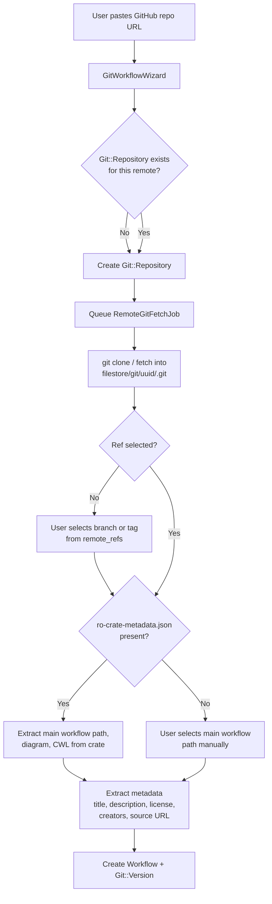

SEEK has several distinct integration points with GitHub. They are independent of each other and can be used in combination.

| Feature | What it does |
|---|---|
| [GitHub URL handling](#github-url-handling) | Detects GitHub URLs and fetches raw content correctly |
| [Workflow import from GitHub](#workflow-import-from-github-repositories) | Imports a workflow directly from a GitHub repository via git |
| [Remote files in git versions](#remote-files-in-git-versions) | Stores references to GitHub-hosted files inside a git-versioned workflow |
| [GitHub OAuth login](#github-oauth-login) | Lets users sign in to SEEK with their GitHub account |
| [Organisation scraper](#organisation-scraper) | Bulk-imports workflows from all repositories in a GitHub organisation |

---

## GitHub URL Handling

When a user pastes a GitHub URL as a remote file reference (on a DataFile, Sop, or other asset), SEEK routes it through `GithubHTTPHandler` instead of the standard `HTTPHandler`.

`ContentBlob.remote_content_handler_for(url)` performs the routing:

```ruby
if uri.hostname.include?('github.com') || uri.hostname.include?('raw.githubusercontent.com')
  Seek::DownloadHandling::GithubHTTPHandler.new(url)
end
```

### What GithubHTTPHandler does differently

**Converts web URLs to raw content URLs.** A web URL like:

```
https://github.com/bob/workflows/blob/master/dir/workflow.cwl
```

is transparently rewritten to:

```
https://raw.githubusercontent.com/bob/workflows/master/dir/workflow.cwl
```

All HTTP requests (HEAD for metadata, GET for content) are made against the raw URL, which returns the actual file bytes rather than the GitHub web page.

**Parses URL components.** The handler extracts `github_user`, `github_repo`, `github_branch`, and `github_path` from the URL and includes them in the `info` hash returned alongside the standard `file_size`, `content_type`, and `file_name` fields.

**Repository URL.** `handler.repository_url` returns `https://github.com/{user}/{repo}` — used when linking back to the source repository.

### In the UI

When a user examines a GitHub URL (the AJAX `examine_url` endpoint), the controller receives the parsed `info` hash and renders a GitHub-specific preview showing a clickable breadcrumb — user / repo / branch / path — that links back to the file on GitHub.

### File: `lib/seek/download_handling/github_http_handler.rb`

---

## Workflow Import from GitHub Repositories

Workflows can be imported directly from a GitHub (or any git) repository URL. This goes through the full git backend — SEEK clones the repository locally and creates a `Git::Version` pointing at the chosen branch or tag.

### Import flow



The wizard steps are: `get_remote` → `select_ref` → `select_paths` (if no RO-Crate) → `provide_metadata` → done.

### Branch and tag selection

`Git::Repository#remote_refs` returns all branches and tags from the cloned repository with their name, ref, commit SHA, and timestamp. The user selects one; it is stored as `git_version.ref`.

### RO-Crate auto-detection

If the selected ref contains `ro-crate-metadata.json` or `ro-crate-metadata.jsonld`, `GitWorkflowWizard` reads it via `ROCrate::WorkflowCrateReader` and auto-populates:

- Main workflow file path → `main_workflow` git annotation
- Diagram path → `diagram` annotation
- Abstract CWL path → `abstract_cwl` annotation
- Programming language → matched to a `WorkflowClass`

See [RO-Crate Support](../ro-crate/) and [Git Versioning Backend](../git-backend/).

### Deduplication

`Git::Repository` is looked up by remote URL — if a repository for the same GitHub URL already exists in SEEK (because another user imported the same repo), the existing local clone is reused and only fetched if it is stale (15-minute debounce on `queue_fetch`).

### Re-fetching

Remote repositories are not automatically kept in sync. The repository can be refreshed by re-importing or by an admin triggering a fetch. `Git::Repository#queue_fetch` is debounced to avoid hammering GitHub.

### Relevant files

- `app/models/git_workflow_wizard.rb` — wizard state machine
- `app/models/git/repository.rb` — local git repo management
- `app/jobs/remote_git_fetch_job.rb` — background fetch job

---

## Remote Files in Git Versions

A git-versioned workflow can reference external files by URL rather than storing their content in the repository. This is used when a workflow crate lists files hosted on GitHub or elsewhere.

A file is added as a remote reference via:

```ruby
git_version.add_remote_file('data/input.csv', 'https://github.com/org/repo/raw/main/data/input.csv',
                             fetch: true, message: 'Add remote input file')
```

This stores an empty placeholder in the git tree and creates a `Git::Annotation` with `key: 'remote_source'` pointing to the URL. If `fetch: true`, `RemoteGitContentFetchingJob` is enqueued to download the actual bytes.

### Blob behaviour

```ruby
blob = git_version.get_blob('data/input.csv')

blob.remote?    # true — URL annotation is present
blob.fetched?   # true if content has been downloaded (blob size > 0)
blob.url        # 'https://github.com/...'

# On-demand fetch if not yet cached:
blob.file_contents(fetch_remote: true)
```

`RemoteGitContentFetchingJob` retries up to 3 times (1-minute backoff) on bad HTTP responses. See [Background Jobs](../background-jobs/).

### Relevant files

- `app/models/git/blob.rb`
- `app/jobs/remote_git_content_fetching_job.rb`

---

## GitHub OAuth Login

GitHub is one of SEEK's supported OmniAuth login providers. To enable it, register a GitHub OAuth App with callback URL `{seek_base_url}/auth/github/callback` and add the client ID and secret in the SEEK admin settings.

See [OAuth Authentication](../oauth-authentication/) for the full flow — identity model, user provisioning, multiple provider linking, and all configuration options.

---

## Organisation Scraper

`Scrapers::GithubScraper` (`lib/scrapers/github_scraper.rb`) bulk-imports workflows from all repositories in a GitHub organisation. It is intended for use by SEEK instances that act as registries for a particular community's workflows.

### What it does

1. Calls `GET https://api.github.com/users/{org}/repos` to list all repositories in the organisation, sorted by last updated.
2. For each repository, fetches the latest tag (or all tags, depending on configuration).
3. Clones the repository into the SEEK git filestore.
4. Extracts workflow metadata via `Seek::WorkflowExtractors::ROCrate` or the generic git extractor.
5. Fetches repository topics via `GET https://api.github.com/repos/{user}/{repo}/topics` and applies them as SEEK tags.
6. Sets `source_link_url` to the GitHub repository URL.
7. Creates or updates the `Workflow` record.

### Usage

```ruby
scraper = Scrapers::GithubScraper.new(
  project,
  contributor,
  organization: 'my-github-org'
)
scraper.scrape
```

### GitHub API

The scraper uses `RestClient` directly against `https://api.github.com` — no third-party SDK. For topics, it includes the `Accept: application/vnd.github.mercy-preview+json` header (the topics API was in preview when this was written).

Unauthenticated requests are subject to GitHub's rate limit (60 requests/hour). For large organisations, provide a token via the `Authorization` header in `RestClient` defaults or configure a GitHub personal access token in SEEK settings.

### Relevant files

- `lib/scrapers/github_scraper.rb`
- `lib/scrapers/github_scraper/workflow_scraper.rb`

---

## Key Files Summary

| File | Purpose |
|---|---|
| `lib/seek/download_handling/github_http_handler.rb` | Raw URL rewriting, URL component parsing |
| `app/models/git_workflow_wizard.rb` | Workflow import wizard (remote git repos) |
| `app/models/git/repository.rb` | Local git clone management, remote_refs |
| `app/models/git/blob.rb` | Remote file annotation and on-demand fetching |
| `app/jobs/remote_git_fetch_job.rb` | Background git clone / fetch |
| `app/jobs/remote_git_content_fetching_job.rb` | Background remote file download (with retry) |
| `lib/scrapers/github_scraper.rb` | Bulk organisation workflow import |
