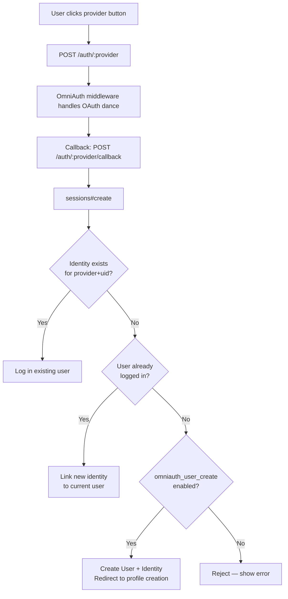

SEEK supports OAuth and OpenID Connect login via [OmniAuth](https://github.com/omniauth/omniauth) alongside its traditional username/password authentication. Multiple providers can be enabled simultaneously. Users can link more than one OAuth identity to the same SEEK account.

## Supported Providers

| Provider | Strategy | Notes |
|---|---|---|
| **GitHub** | `omniauth-github` | OAuth 2.0 |
| **ELIXIR AAI / LS Login** | `omniauth-openid_connect` | OpenID Connect; the recommended provider for life-sciences instances |
| **Generic OIDC** | `omniauth-openid_connect` | Any OpenID Connect-compatible provider; name and logo are configurable |
| **LDAP** | `gitlab_omniauth-ldap` | Credentials entered in SEEK's login form and validated against an LDAP server |

ORCID is **not** an OAuth login provider in SEEK — it is used only for manual profile enrichment (the `orcid` field on a `Person` record).

## Authentication Flow



### Key steps in `sessions#create`

1. `Identity.from_omniauth(auth)` looks up the `(provider, uid)` pair.
2. If a matching `Identity` exists, its `User` is signed in.
3. If the user is already signed in (linking flow), a new `Identity` is attached to the current user.
4. If no identity exists and `omniauth_user_create` is enabled, a new `User` is created with a random login and random password, and the OAuth profile data is passed to the registration flow.
5. If `omniauth_user_activate` is enabled, the new user is activated immediately — otherwise they must confirm their email.

## Identity Model

`Identity` (`app/models/identity.rb`) is a simple join record:

| Column | Purpose |
|---|---|
| `user_id` | FK to `users` |
| `provider` | Provider name — e.g. `'github'`, `'elixir_aai'`, `'ldap'`, `'oidc'` |
| `uid` | Unique identifier from the provider |

A composite index on `(provider, uid)` makes lookups fast. A single `User` can have many `Identity` records.

## User Provisioning

SEEK uses custom Restful Authentication (not Devise). A `User` record stores a salted SHA256 password, but OAuth users receive a randomly generated password they never need to know.

When a new OAuth user logs in:

1. A `User` is created with `User.unique_login(auth['info']['nickname'])` and `User.random_password`.
2. An `Identity` is created for `(provider, uid)`.
3. The user is redirected to the person registration form, pre-filled with `first_name`, `last_name`, and `email` extracted from the OAuth profile.
4. Only after completing registration (creating a `Person` record) is the account fully active.

Users can later set a password via the account settings if they want to use standard login as well.

## Linking Multiple Identities

A logged-in user can add additional OAuth providers to their account. The flow is the same as first login — after the OAuth callback, `sessions#create` detects that a user is already signed in and calls `link_identity_to_user(auth)` instead of creating a new user.

Users can see and remove their linked identities at `/users/:id/identities`. A warning is shown if removing an identity would leave no way to log in — ensure at least one identity or a known password remains.

## Standard Login Coexistence

Username/password login and OAuth login coexist. The login form shows tabs for enabled providers alongside the standard login tab. If an admin needs emergency access when OAuth is misconfigured, append `?show_standard_login=true` to the login URL to force the password tab to appear regardless of the `standard_login_enabled` setting.

## ELIXIR AAI / LS Login

ELIXIR AAI uses OpenID Connect with SEEK configured as a relying party. The issuer is `https://login.aai.lifescience-ri.eu/oidc/` with OIDC discovery enabled.

A legacy mode exists for older deployments that used `https://login.elixir-czech.org/oidc/` — enable `omniauth_elixir_aai_legacy_mode` to use the old endpoint with its hardcoded JWK signing key.

## LDAP

LDAP differs from the other providers in that credentials are entered directly in SEEK's login form rather than via a redirect. The form POSTs to `/auth/ldap/callback` and the OmniAuth LDAP strategy validates the credentials against the configured server.

LDAP config requires: host, port, encryption method (SSL/TLS/Plain), base DN, username attribute (e.g. `uid`), and optionally a bind DN and password.

## Configuration

All OAuth settings are managed via `Seek::Config` and can be changed in the admin UI at `/admin/settings` without restarting the server. Secrets are stored encrypted using `attr_encrypted` with a key file at `Seek::Config.attr_encrypted_key_path`.

### Global toggles

| Setting | Default | Effect |
|---|---|---|
| `omniauth_enabled` | false | Master switch for all OAuth providers |
| `omniauth_user_create` | false | Allow new users to be created on first OAuth login |
| `omniauth_user_activate` | false | Auto-activate new OAuth users without email confirmation |
| `standard_login_enabled` | true | Show the username/password tab |

### GitHub

| Setting | Purpose |
|---|---|
| `omniauth_github_enabled` | Enable GitHub provider |
| `omniauth_github_client_id` | OAuth App client ID |
| `omniauth_github_secret` | OAuth App client secret (encrypted) |

Callback URL to register in the GitHub OAuth App: `{seek_base_url}/auth/github/callback`

### ELIXIR AAI / LS Login

| Setting | Purpose |
|---|---|
| `omniauth_elixir_aai_enabled` | Enable ELIXIR AAI provider |
| `omniauth_elixir_aai_client_id` | Client ID |
| `omniauth_elixir_aai_secret` | Client secret (encrypted) |
| `omniauth_elixir_aai_legacy_mode` | Use old ELIXIR Czech endpoint |

### Generic OIDC

| Setting | Purpose |
|---|---|
| `omniauth_oidc_enabled` | Enable OIDC provider |
| `omniauth_oidc_name` | Display name on the login button |
| `omniauth_oidc_image_id` | Avatar ID for the login button logo |
| `omniauth_oidc_issuer` | OIDC discovery URL |
| `omniauth_oidc_client_id` | Client ID |
| `omniauth_oidc_secret` | Client secret (encrypted) |

### LDAP

| Setting | Purpose |
|---|---|
| `omniauth_ldap_enabled` | Enable LDAP provider |
| `omniauth_ldap_config` | Hash: host, port, method, base, uid, bind_dn, password (encrypted) |

## Routes

```
POST /auth/:provider                   → OmniAuth initiates the flow
GET  /auth/:provider/callback          → sessions#create (OAuth callback)
POST /auth/:provider/callback          → sessions#create
GET  /auth/failure                     → sessions#omniauth_failure
GET  /users/:id/identities             → identities#index
DELETE /users/:id/identities/:id       → identities#destroy
```

A legacy route `/identities/auth/:provider/callback` is also supported for backwards compatibility.

## NeLS (Data Access OAuth — Not Login)

The Norwegian e-Infrastructure for Life Sciences (NeLS) uses a separate OAuth flow for **data access**, not login. NeLS OAuth tokens are stored in `OAuthSession` (linked to a `User`) and used for file transfer and metadata lookup via the NeLS API. This is entirely separate from the OmniAuth login system. See [Content Blobs and File Storage](../content-blobs/) for how NeLS blobs are handled.

## Key Files

| File | Purpose |
|---|---|
| `config/initializers/seek_omniauth.rb` | OmniAuth middleware setup |
| `app/controllers/sessions_controller.rb` | Authentication logic and OAuth callbacks |
| `app/models/identity.rb` | OAuth identity storage |
| `app/models/user.rb` | User model, password auth, OAuth user creation |
| `app/controllers/identities_controller.rb` | Identity linking and unlinking |
| `lib/authenticated_system.rb` | Session resolution (`current_user`) |
| `lib/seek/config.rb` | Config accessors for all OAuth settings |
| `app/views/admin/_omniauth.html.erb` | Admin UI for OAuth settings |
| `app/views/gadgets/_sign_in.html.erb` | Login form with provider tabs |
