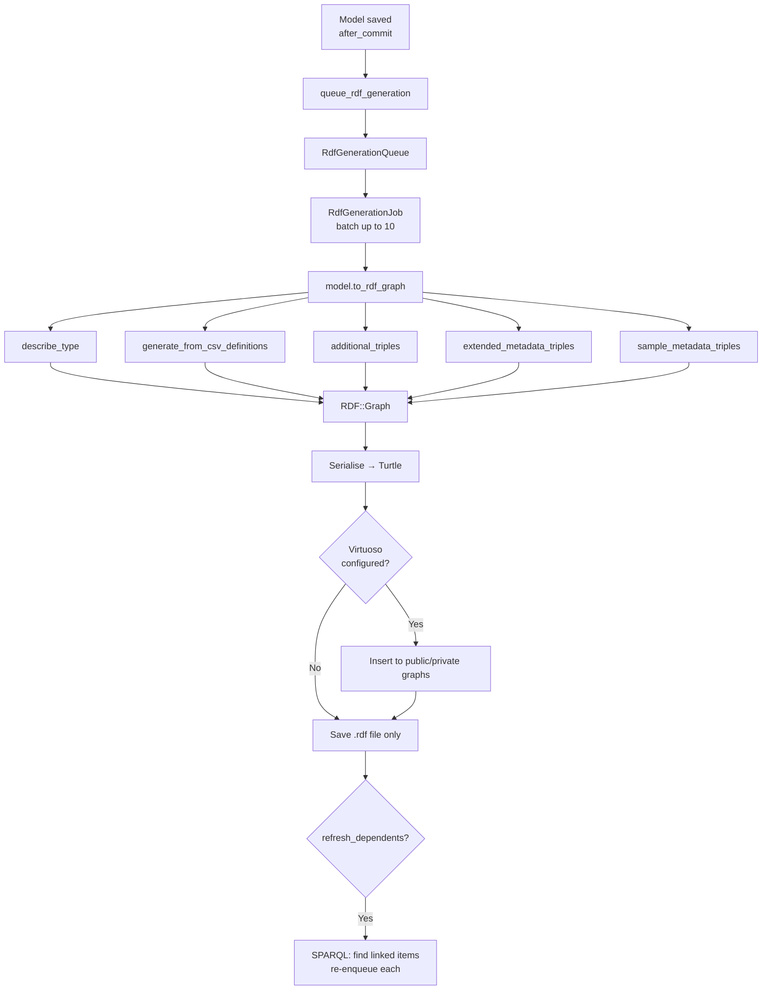

SEEK generates RDF for all major content types automatically on create/update. The generated triples are stored both as Turtle files on disk and — when Virtuoso is configured — pushed to a triple store for SPARQL querying.

## Overview



`lib/seek/rdf/rdf_generation.rb`

## Models that generate RDF

15 models include `Seek::Rdf::RdfGeneration`:

| Model | JERM type |
|---|---|
| `DataFile` | `jerm:Data` |
| `Model` | `jerm:Model` |
| `Sop` | `jerm:SOP` |
| `Workflow` | `jerm:Workflow` |
| `Document` | `jerm:Document` |
| `Presentation` | `jerm:Presentation` |
| `FileTemplate` | `jerm:FileTemplate` |
| `Placeholder` | `jerm:Placeholder` |
| `Collection` | `jerm:Collection` |
| `Publication` | `jerm:Publication` |
| `Sample` | `jerm:Sample` |
| `ObservationUnit` | `ppeo:observation_unit` |
| `Organism` | `jerm:Organism` |
| `Strain` | `jerm:Strain` |
| `HumanDisease` | `jerm:HumanDisease` |

`lib/seek/rdf/jerm_vocab.rb`

## Triple generation

`to_rdf_graph` builds an `RDF::Graph` in four steps:

### 1. Type triples

`describe_type` emits `rdf:type` statements using JERM vocabulary types. Every resource also gets `owl:sameAs` linking to its canonical SEEK URI.

### 2. CSV-driven property mappings

The bulk of triples come from `lib/seek/rdf/rdf_mappings.csv`. Each row maps a model method to an RDF property:

| Column | Meaning |
|---|---|
| `class` | Model class name, or `*` for all |
| `method` | Method called on the model instance |
| `property` | RDF property URI (Ruby expression, e.g. `RDF::Vocab::DC.title`) |
| `uri_or_literal` | `u` → URI node, `l` → typed literal |
| `transformation` | Ruby snippet applied to each individual value |
| `collection_transformation` | Ruby snippet applied to the whole collection (e.g. `compact`) |

Example rows:

```
*,title,RDF::Vocab::DC.title,l,,
*,description,RDF::Vocab::DC.description,l,,compact
*,contributors,JERMVocab.hasContributor,u,,compact
DataFile,assays,JERMVocab.isPartOf,u,,compact
Sample,observation_unit,JERMVocab.isPartOf,u,,compact
Project,web_page,FOAF.homepage,u,,compact
```

`lib/seek/rdf/csv_mappings_handling.rb`

### 3. Additional triples

`additional_triples` is an optional hook for model-specific triples not expressible in CSV. For example, `Model` uses it to add SBML format statements.

### 4. Extended metadata & sample attribute triples

If a resource has extended metadata with `pid`-annotated attributes, each attribute whose value is non-blank is emitted as a triple using the `pid` URI as the predicate:

```turtle
<https://seek.example.org/studies/1>
    <http://purl.obolibrary.org/obo/OBI_0000272> "Sample Prep v2" .
```

Sample attributes work identically — any `SampleAttribute` with a `pid` set is included, with values cast to the appropriate XSD type (`xsd:integer`, `xsd:double`, `xsd:boolean`, `xsd:date`, `xsd:dateTime`).

## Vocabularies

| Prefix | URI | Used for |
|---|---|---|
| `jerm` | `http://jermontology.org/ontology/JERMOntology#` | SEEK resource types and relationships |
| `dcterms` | `http://purl.org/dc/terms/` | title, description, created, modified |
| `foaf` | `http://xmlns.com/foaf/0.1/` | name, homepage, mbox |
| `sioc` | `http://rdfs.org/sioc/ns#` | creator, topic |
| `owl` | `http://www.w3.org/2002/07/owl#` | sameAs |
| `xsd` | `http://www.w3.org/2001/XMLSchema#` | typed literals |
| `mixs` | `https://w3id.org/mixs/` | Minimum Information about any (X) Sequence |
| `ppeo` | `http://purl.org/ppeo/PPEO.owl#` | ObservationUnit |

The full JERM ontology is at `config/ontologies/JERM.rdf`.

## Serialisation formats

`to_rdf_graph` returns an `RDF::Graph`. This is then serialised on demand:

| Method | Format | Gem |
|---|---|---|
| `to_rdf` | Turtle (`.ttl`) | `rdf/turtle` |
| `to_json_ld` | JSON-LD | `json-ld` |
| (via content negotiation) | RDF/XML | `rdf/rdfxml` |

## File storage

Whether or not Virtuoso is configured, a Turtle file is always written to disk:

```
{Seek::Config.rdf_filestore_path}/
├── public/
│   └── DataFile-production-42.rdf
└── private/
    └── DataFile-production-43.rdf
```

Public resources are written to `public/`; private resources to `private/`. If a resource's visibility changes, the old file is deleted and a new one written in the correct location.

`lib/seek/rdf/rdf_file_storage.rb`

## Async generation pipeline

### Lifecycle hooks

```ruby
after_commit :queue_rdf_generation, on: [:create, :update]
before_destroy :remove_rdf
```

### `RdfGenerationQueue`

A `ResourceQueue` subclass. Items are enqueued with a `refresh_dependents` flag. When `true`, after generating RDF for the item, the job queries the triple store to find all resources that link to this item and re-enqueues them.

`app/models/rdf_generation_queue.rb`

### `RdfGenerationJob`

Processes up to 10 queue entries per run. Creates a follow-on job automatically if more items remain.

For each entry:

1. Calls `to_rdf_graph` to build the graph
2. If repository configured: `update_repository_rdf` (remove old triples, insert new)
3. Saves Turtle file to disk
4. If `refresh_dependents`: SPARQL query to find linked items → re-enqueue each

`app/jobs/rdf_generation_job.rb`

### Dependent item tracking

`lib/seek/rdf/react_to_associated_change.rb` tracks which associations cause related resources to be re-queued. For example, updating a `DataFile` will also re-queue any linked `Assay` records, so their RDF stays consistent.

## Generating RDF manually

```ruby
# Generate Turtle string
project.to_rdf

# Get the graph object
graph = project.to_rdf_graph

# Queue regeneration
project.queue_rdf_generation

# Force immediate update to repository and file
project.update_repository_rdf
```

### Bulk generation (rake)

```bash
bundle exec rake seek_rdf:generate
```

Enqueues every RDF-capable resource for generation. Use after configuration changes or a fresh Virtuoso setup.

`lib/tasks/seek_rdf.rake`
