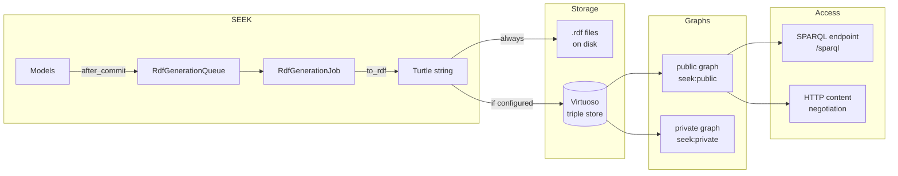

SEEK can push all generated RDF into an [OpenLink Virtuoso](https://virtuoso.openlinksw.com/) triple store, making the full SEEK knowledge graph available for SPARQL queries and linked data consumption. This is optional — SEEK functions without it, storing RDF as flat files.

## Architecture



## Named graphs

Virtuoso holds two named graphs per SEEK instance:

| Graph | Default name | Who can read |
|---|---|---|
| Public | `seek:public` | Everyone (used by `/sparql` and linked data consumers) |
| Private | `seek:private` | Internal queries only (includes non-public resources) |

Public resources are written to **both** graphs. Private resources are written to the **private graph only**.

When a resource's visibility changes, old triples are deleted and new ones inserted into the correct graph(s).

## Setting up Virtuoso with Docker

The repository ships a Virtuoso-specific compose file. It can be run standalone or layered over the standard `docker-compose.yml`.

### Start Virtuoso

```bash
# Standalone (just Virtuoso)
docker compose -f docker-compose-virtuoso.yml up -d

# Alongside the main SEEK stack
docker compose -f docker-compose.yml -f docker-compose-virtuoso.yml up -d
```

The compose file uses `openlink/virtuoso-opensource-7:7.2.15` and exposes:

| Port | Service |
|---|---|
| `8890` | Virtuoso HTTP / SPARQL endpoint |
| `1111` | iSQL (interactive SQL shell) |

Data persists in the `seek-virtuoso-data` named volume.

### Environment variables (`docker/virtuoso.env`)

```bash
DBA_PASSWORD=CHANGE_ME          # Admin password — set this before first run
RDF_PUBLIC_GRAPH=seek:public    # Named graph for public triples
# RDF_PRIVATE_GRAPH=seek:private  # Optional — defaults to seek:private
VIRTUOSO=true                   # Signal to SEEK that Virtuoso is available
```

## Configuring SEEK to use Virtuoso

Copy the example config and edit it:

```bash
cp config/virtuoso_settings.example.yml config/virtuoso_settings.yml
```

`config/virtuoso_settings.yml`:

```yaml
production:
  uri:         http://localhost:8890/sparql        # Read-only SPARQL endpoint
  update_uri:  http://localhost:8890/sparql-auth   # Authenticated write endpoint
  username:    dba
  password:    CHANGE_ME
  public_graph:  seek:public
  private_graph: seek:private

development:
  uri:         http://localhost:8890/sparql
  update_uri:  http://localhost:8890/sparql-auth
  username:    dba
  password:    CHANGE_ME
  public_graph:  seek-development:public
  private_graph: seek-development:private

test:
  disabled: true    # Keep disabled in test to avoid side effects
```

Use separate graph names per environment to keep development and production triples isolated within the same Virtuoso instance.

To disable Virtuoso for a specific environment without removing the file, add `disabled: true`.

`lib/seek/rdf/virtuoso_repository.rb`

## Verifying the connection

In a Rails console:

```ruby
repo = Seek::Rdf::RdfRepository.instance
repo.configured?   # => true
repo.available?    # => true (executes an ASK query to verify connectivity)
```

If `available?` returns `false`, check that:
- Virtuoso is running and reachable at the configured `uri`
- The `update_uri` requires digest authentication (Virtuoso default)
- `username` / `password` match the `DBA_PASSWORD` set at container startup

## Building the knowledge graph

### Initial population

After configuring `virtuoso_settings.yml` and starting Virtuoso, enqueue all resources for RDF generation:

```bash
bundle exec rake seek_rdf:generate
```

This enqueues every RDF-capable resource. The `RdfGenerationJob` workers process them in batches of 10. Monitor progress via the job queue or Virtuoso's admin interface at `http://localhost:8890/conductor`.

For large instances, run multiple Delayed Job workers to speed up the bulk load:

```bash
bundle exec rake jobs:work
```

### Keeping the graph in sync

No manual intervention is needed after the initial load. Every model save triggers `queue_rdf_generation` via an `after_commit` hook, which updates both the file store and the triple store automatically.

When `refresh_dependents: true` (the default), the job also re-queues any resource whose URI appears in the triples of the saved item, keeping cross-resource links consistent.

### Rebuilding from scratch

To wipe and regenerate all triples:

```bash
# 1. Drop all triples in both graphs (Virtuoso iSQL)
docker exec -it seek-virtuoso isql 1111 dba CHANGE_ME \
  "SPARQL CLEAR GRAPH <seek:public>; SPARQL CLEAR GRAPH <seek:private>;"

# 2. Re-enqueue all resources
bundle exec rake seek_rdf:generate
```

## SPARQL access

### Browser interface

Virtuoso's built-in SPARQL endpoint: `http://localhost:8890/sparql`

SEEK's own SPARQL UI (requires Virtuoso): `/sparql`

### Example knowledge graph queries

**Full ISA hierarchy for a project:**

```sparql
PREFIX jerm: <http://jermontology.org/ontology/JERMOntology#>
PREFIX dcterms: <http://purl.org/dc/terms/>

SELECT ?inv ?invTitle ?study ?studyTitle ?assay ?assayTitle WHERE {
  ?inv  a jerm:Investigation ; dcterms:title ?invTitle ;
        jerm:itemProducedBy <https://seek.example.org/projects/1> .
  ?study a jerm:Study ; dcterms:title ?studyTitle ;
         jerm:isPartOf ?inv .
  ?assay a jerm:Assay ; dcterms:title ?assayTitle ;
         jerm:isPartOf ?study .
}
ORDER BY ?invTitle ?studyTitle ?assayTitle
```

**All samples linked to an assay with their attribute values:**

```sparql
PREFIX jerm: <http://jermontology.org/ontology/JERMOntology#>
PREFIX dcterms: <http://purl.org/dc/terms/>

SELECT ?sample ?title ?predicate ?value WHERE {
  ?sample a jerm:Sample ;
          dcterms:title ?title ;
          jerm:hasPart <https://seek.example.org/assays/5> ;
          ?predicate ?value .
  FILTER(?predicate != rdf:type)
}
```

**Resources using a specific extended metadata type (by PID):**

```sparql
SELECT DISTINCT ?resource WHERE {
  ?resource <http://purl.obolibrary.org/obo/OBI_0000272> ?protocol .
}
```

**Contributor graph — who contributed to what:**

```sparql
PREFIX jerm: <http://jermontology.org/ontology/JERMOntology#>
PREFIX foaf: <http://xmlns.com/foaf/0.1/>

SELECT ?person ?name ?resource ?type WHERE {
  ?person a foaf:Person ; foaf:name ?name .
  ?resource jerm:hasContributor ?person ; a ?type .
}
ORDER BY ?name
```

## How triples are pushed to Virtuoso

`Seek::Rdf::VirtuosoRepository` wraps `RDF::Virtuoso::Repository` (from the `rdf-virtuoso` gem) and uses digest authentication against the `update_uri`.

The write flow in `RdfRepository#send_rdf`:

1. Parse the Turtle string into an `RDF::Graph`
2. Validate each statement (blank subjects are skipped)
3. Determine target graphs based on the resource's visibility
4. Execute `SPARQL INSERT DATA { GRAPH <graph> { ... } }` for each graph

The delete flow in `RdfRepository#remove_rdf`:

```sparql
DELETE { GRAPH <seek:public>  { <resource-uri> ?p ?o } }
WHERE  { GRAPH <seek:public>  { <resource-uri> ?p ?o } }

DELETE { GRAPH <seek:private> { <resource-uri> ?p ?o } }
WHERE  { GRAPH <seek:private> { <resource-uri> ?p ?o } }
```

`lib/seek/rdf/rdf_repository.rb`, `lib/seek/rdf/virtuoso_repository.rb`

## Troubleshooting

**Triples not appearing after save**
- Check `RdfGenerationQueue` and Delayed Job workers are running
- Check `repo.available?` returns `true`
- Look for errors in the job queue: `Delayed::Job.where('failed_at IS NOT NULL').last.last_error`

**Authentication errors**
- Virtuoso uses digest auth on the SPARQL update endpoint — confirm `username`/`password` are correct
- Verify with: `curl --digest -u dba:CHANGE_ME http://localhost:8890/sparql-auth`

**Stale triples after visibility change**
- The `remove_rdf` / `send_rdf` cycle should handle this automatically on the next save
- Force it manually: `Seek::Rdf::RdfRepository.instance.update_rdf(resource)`

**Development environment using production graphs**
- Use distinct `public_graph` / `private_graph` names per environment (e.g. `seek-development:public`) to prevent cross-contamination
