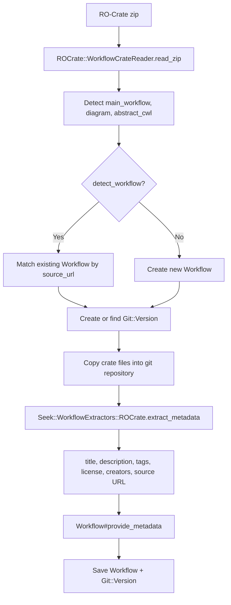

[RO-Crate](https://www.researchobject.org/ro-crate/) (Research Object Crate) is a community specification for packaging research data with structured metadata. SEEK uses it as the primary interchange format for computational workflows, enabling import and export with WorkflowHub and other compatible systems.

## Overview

RO-Crate support in SEEK centres on the `Workflow` model. A crate is a zip archive containing a `ro-crate-metadata.json` file (JSON-LD) alongside the workflow files, diagrams, and associated resources. SEEK can both generate crates from existing workflows and create new workflows by importing a crate.

SEEK implements the [Workflow RO-Crate 1.0 profile](https://w3id.org/workflowhub/workflow-ro-crate/1.0), which extends the base specification with mandatory fields for computational workflows: a `mainEntity` pointing to the primary workflow file, language metadata, and optional diagram and abstract CWL entries.

## Dependencies

SEEK uses the `ro-crate` Ruby gem (declared in `Gemfile`) for reading and writing crate structures. SEEK extends this gem with custom subclasses in `lib/overrides/ro_crate/`:

| Class | Extends | Purpose |
|---|---|---|
| `ROCrate::WorkflowCrate` | `ROCrate::Crate` | Crate with Workflow profile, `mainEntity`, test suites |
| `ROCrate::Workflow` | `ROCrate::File` | Main workflow file entity with language, image, CWL description |
| `ROCrate::WorkflowDiagram` | `ROCrate::File` | Diagram image entity (`ImageObject`) |
| `ROCrate::WorkflowDescription` | `ROCrate::File` | Abstract CWL description (`HowTo`) |
| `ROCrate::WorkflowCrateReader` | — | Reads zip files into `WorkflowCrate` objects |

## Storage Architectures

SEEK supports two storage approaches for workflow files. The approach used depends on whether `Seek::Config.git_support_enabled` is true.

### Git-backed (modern)

Workflows are stored as Git repositories. Each version is a Git branch or tag. A version is treated as an RO-Crate if the repository root contains `ro-crate-metadata.json` or `ro-crate-metadata.jsonld`.

```ruby
git_version.ro_crate?
# => true if ro-crate-metadata.json exists in the repo root
```

Git-backed workflows always export a valid Workflow RO-Crate. If the repository already contains a `ro-crate-metadata.json`, that metadata is merged with SEEK's generated metadata. Otherwise a fresh crate is generated from the repository's files.

### Content blob (legacy)

Workflows uploaded as zip files with a `.crate.zip` suffix are treated as pre-packaged RO-Crates and passed through unchanged on export. Files without this suffix get a generated crate wrapping the uploaded file.

`Legacy::WorkflowCrateBuilder` (`app/models/legacy/workflow_crate_builder.rb`) constructs in-memory `WorkflowCrate` objects when creating a crate from individual uploaded files.

## Export

### How a crate is generated

The `WorkflowExtraction` concern (included in `Workflow` and `Workflow::Version`) provides the export logic:

```ruby
workflow.ro_crate      # => ROCrate::WorkflowCrate object
workflow.ro_crate_zip  # => path to generated zip file
```

The `populate_ro_crate` method builds the crate contents:

**For git-backed workflows:**
- All repository files are added to the crate
- The annotated main workflow path, diagram path, and abstract CWL path are set as the crate's `mainEntity`, `image`, and `subjectOf` respectively
- Remote files referenced by URL are included as external file entities
- README.md is included from the repository

**For content blob workflows:**
- The uploaded file is added as the main workflow entity
- A minimal crate is generated around it

### Metadata written into the crate

The crate's root metadata entity receives:

| Field | Source |
|---|---|
| `author` / `creator` | `Person` entities with ORCID and affiliation |
| `license` | Normalised SPDX URL via `Seek::License.normalize()` |
| `identifier` | DOI or SEEK URL |
| `url` | Workflow URL on this SEEK instance |
| `datePublished` | Commit timestamp or current time |
| `programmingLanguage` | `WorkflowClass#ro_crate_metadata` |
| `creativeWorkStatus` | Maturity level |

BioSchema metadata (`ComputationalWorkflow`) is serialised, flattened to JSON-LD, and merged into the crate via `merge_entities()`, enriching the main workflow entity with standardised schema.org fields.

### License detection

`lib/licensee/projects/ro_crate_project.rb` provides a custom [Licensee](https://github.com/licensee/licensee) project class. When importing a crate, if no `license` field is present in the metadata, SEEK scans all crate entries for LICENSE/COPYING files and uses Licensee to identify the license.

## Import

### Two import paths

**Modern (git-backed):** `WorkflowCrateExtractor` (`app/forms/workflow_crate_extractor.rb`) is the form object used for all UI and API import flows when git support is enabled.

**Legacy:** `Legacy::WorkflowCrateBuilder` handles the old content-blob approach.

### Import flow



The `WorkflowCrateExtractor` can also detect an existing SEEK workflow by matching the crate's `source_url` (extracted from `isBasedOn`, `url`, or the main workflow's metadata). When `detect_workflow: true` is passed, this is checked before creating a new record.

### Metadata extraction

`Seek::WorkflowExtractors::ROCrate` (`lib/seek/workflow_extractors/rocrate.rb`) inherits from `Seek::WorkflowExtractors::ROLike` and handles:

- **Title and description** — from crate root metadata
- **Tags/keywords** — from `keywords` field
- **Authors** — `Person` entities with ORCID and affiliation, or plain name strings
- **Other creators** — non-Person creator entities
- **License** — normalised via `Seek::License.normalize()`
- **Source URL** — from `isBasedOn`, `url`, or main workflow entity
- **Diagram** — from the workflow's `image` property; generated dynamically if absent
- **CFF metadata** — from `CITATION.cff` if present in the crate
- **README** — used as fallback description source

## HTTP Endpoints

### Download

```
GET /workflows/:id/ro_crate           → download as zip
GET /workflows/:id/ro_crate_metadata  → download ro-crate-metadata.json only
```

### Create

```
POST /workflows/create_from_ro_crate              → UI: new workflow from crate zip
POST /workflows/:id/create_version_from_ro_crate  → UI: new version from crate zip
POST /workflows/submit                            → detect existing or create new
```

### API

```
POST /workflows            # with ro_crate param → create via JSON API
POST /workflows/:id/create_version  # with ro_crate param → new version via API
```

The `submit` endpoint is used by WorkflowHub to push workflows into SEEK; it checks for an existing record by `source_url` before creating a new one.

## GA4GH TRS API

The [GA4GH Tool Registry Service v2 API](https://www.ga4gh.org/news/tool-registry-service-api-enabling-the-discovery-of-workflows-together/) exposes workflow crate contents:

```
GET /ga4gh/trs/v2/tools/{id}/versions/{version_id}
  descriptor           → main workflow file from crate
  tests                → test files (tests/*.json)
  files?format=zip     → full RO-Crate zip
  containerfile        → Dockerfile from crate
```

Each SEEK workflow is presented as a TRS "tool", and the crate's contents are served through the TRS file descriptors.

## Git Wizard Integration

When adding a workflow from a git repository URL (`GitWorkflowWizard`, `app/models/git_workflow_wizard.rb`), SEEK automatically:

1. Detects whether the repository contains `ro-crate-metadata.json`
2. Reads the crate via `ROCrate::WorkflowCrateReader.read()` and extracts `mainEntity`, diagram, and abstract CWL paths
3. Auto-populates the workflow form with these paths
4. Detects the `programmingLanguage` entity and maps it to a SEEK `WorkflowClass`

## Workflow RO-Crate Profile Compliance

SEEK's generated crates declare conformance to the Workflow RO-Crate 1.0 profile via `conformsTo` in the root metadata entity. The mandatory profile requirements are:

- `mainEntity` — points to the primary workflow file
- Main workflow `@type` — `["File", "SoftwareSourceCode", "ComputationalWorkflow"]`
- `programmingLanguage` — contextual entity with `name`, `alternateName`, `identifier`, and `url`
- `image` (optional) — workflow diagram as `ImageObject`
- `subjectOf` (optional) — abstract CWL file as `HowTo`
- Test suites declared via `mentions` or `about` with type `TestSuite`

## Related Pages

- [Samples and SampleTypes](../samples/) — another metadata packaging feature that uses JSON-LD internally
- [SEEK Project Structure](../seek-project-structure/) — overview of where RO-Crate code sits within the SEEK codebase
