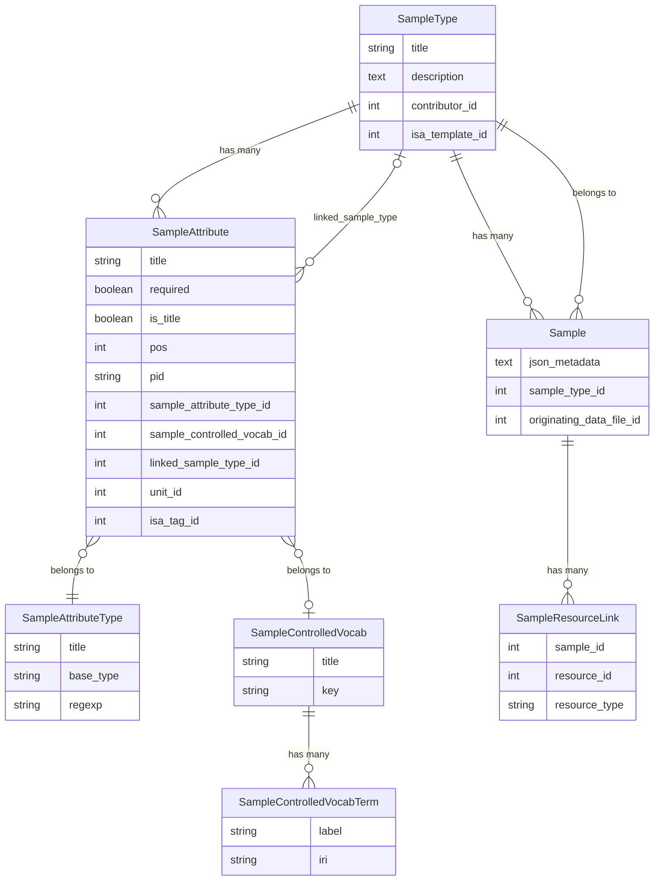

# Samples and Sample Types

SEEK's sample management system lets users define typed schemas (SampleTypes) and then create structured data records (Samples) conforming to those schemas. All attribute values are stored as JSON. The system shares its type registry, controlled vocabulary infrastructure, and JSON serialisation layer with Extended Metadata — see [the overlap section](#overlap-with-extended-metadata) for details.

---

## Data Model



---

## Core Models

### `SampleType` (`app/models/sample_type.rb`)

The schema for a family of samples. Acts as an asset (`acts_as_asset`) so it has a contributor, projects, versioning, and access control.

Key relationships:
- `has_many :sample_attributes` (ordered by `pos`) — the attribute schema
- `has_many :samples` — all samples created from this type
- `has_and_belongs_to_many :studies` — types can be associated with ISA studies
- `belongs_to :isa_template` (optional) — if created from an ISA template

Validation rules enforced on the type itself:
- Exactly one attribute must have `is_title: true`
- Attribute titles must be unique within the type
- Attribute accessor names (derived from titles) must be unique
- The title attribute cannot be of type `SeekSampleMulti`
- The type cannot be edited while it is locked (during a bulk sample metadata update)

A `SampleType` is **locked** while a `SampleMetadataUpdateJob` is in progress over its samples. `locked?` checks `sample_metadata_update_task.in_progress?`. All state-change methods (`state_allows_edit?`, `state_allows_delete?`, etc.) return `false` when locked.

Access control: `can_create?` requires the user to be a logged-in project member and `Seek::Config.samples_enabled` to be true. When `project_admin_sample_type_restriction` is enabled (see [Configuration Settings](configuration-settings)), only project admins can create types.

### `Sample` (`app/models/sample.rb`)

A single sample record. Also acts as an asset (permissions, auditing, tagging, search indexing).

Key relationships:
- `belongs_to :sample_type` (required)
- `belongs_to :originating_data_file` (optional) — set when extracted from a spreadsheet
- `has_many :sample_resource_links` — polymorphic links to Strains, Samples, DataFiles, and SOPs referenced in attribute values
- `belongs_to :observation_unit` (optional)

The `title` column is automatically populated from whichever `SampleAttribute` has `is_title: true`, via a `before_validation` callback. Users do not set it directly.

If a sample was extracted from a DataFile, its `creators` are delegated to the data file, and an edit warning is shown in the UI.

### `SampleAttribute` (`app/models/sample_attribute.rb`)

One field definition within a SampleType. Includes `Seek::JSONMetadata::Attribute` (shared with `ExtendedMetadataAttribute`).

| Column | Purpose |
|---|---|
| `title` | Human-readable name; also used as the JSON key (`accessor_name`) |
| `sample_attribute_type_id` | The data type — see [Attribute Types](#attribute-types) |
| `required` | Whether a value must be present on every sample |
| `is_title` | If true, this attribute's value becomes `sample.title`; always forced required |
| `pos` | Display and column order |
| `pid` | Optional persistent identifier (ontology URI) |
| `sample_controlled_vocab_id` | Set for `CV` and `CVList` types |
| `linked_sample_type_id` | Set for `SeekSample` and `SeekSampleMulti` types |
| `unit_id` | For numeric attributes with a physical unit |
| `isa_tag_id` | Links to an ISA tag (input/output/parameter) |
| `template_attribute_id` | If inherited from an ISA template attribute |

`accessor_name` returns the attribute's `title` and is used as the key in the JSON metadata hash.

### `SampleAttributeType` (`app/models/sample_attribute_type.rb`)

A shared registry of value types. **Used by both `SampleAttribute` and `ExtendedMetadataAttribute`** — there is only one `sample_attribute_types` table. See [Attribute Types](#attribute-types) below, and [Extended Metadata Attribute Types](extended-metadata-attribute-types) for the full reference (the type list is identical for both systems).

Key columns: `title`, `base_type` (one of the constants in `lib/seek/samples/base_type.rb`), `regexp` (for string validation), `resolution` (URI resolution pattern), `placeholder` (UI hint).

The table is pre-populated by `db/seeds/007_sample_attribute_types.seeds.rb`.

### `SampleControlledVocab` and `SampleControlledVocabTerm`

A shared vocabulary registry — also **used by both `SampleAttribute` and `ExtendedMetadataAttribute`**. See [Controlled Vocabularies](#controlled-vocabularies).

---

## Attribute Types

The `base_type` of a `SampleAttributeType` determines how values are stored, validated, and rendered. The full list is defined in `lib/seek/samples/base_type.rb` and is shared with the Extended Metadata system.

For the complete reference see [Extended Metadata Attribute Types](extended-metadata-attribute-types) — the type catalogue is identical. The types most specific to the Sample system are:

| Base type | Description |
|---|---|
| `SeekSample` | A single reference to another Sample (must specify `linked_sample_type`) |
| `SeekSampleMulti` | An array of references to other Samples of the same type |
| `SeekStrain` | A reference to a Strain record |
| `SeekDataFile` | A reference to a DataFile |
| `SeekSop` | A reference to a SOP |
| `LinkedExtendedMetadata` | An inline nested ExtendedMetadataType (see [overlap section](#overlap-with-extended-metadata)) |
| `LinkedExtendedMetadataMulti` | An array of inline nested ExtendedMetadataType instances |

The ISA input pattern uses `SeekSampleMulti` on an attribute whose `isa_tag` marks it as an input. `input_attribute?` returns `true` for these.

---

## JSON Storage

All attribute values are stored in a single `json_metadata` TEXT column on the `samples` table. There is no EAV table.

Example JSON for a sample with a string field, a numeric field, and a linked sample:

```json
{
  "name": "Sample A",
  "age_days": 14,
  "parent_sample": { "id": 42, "title": "Parent", "type": "Sample" },
  "child_samples": [
    { "id": 10, "title": "Child 1", "type": "Sample" },
    { "id": 11, "title": "Child 2", "type": "Sample" }
  ]
}
```

Linked resources (samples, strains, data files, SOPs) are stored as `{id, title, type}` hashes so the stored title is readable without a join. Titles are kept up to date by `LinkingSamplesUpdateJob` when the referenced record is renamed.

### `Seek::JSONMetadata::Data` (`lib/seek/json_metadata/data.rb`)

A `HashWithIndifferentAccess` subclass that wraps the raw JSON string. Instantiated lazily via the `data` accessor on `Sample`. It:

- initialises an empty keyed structure from `sample_type.sample_attributes` when the JSON is blank
- pre-processes values through the attribute's type handler on assignment (`data['field'] = value`)
- validates that assigned keys correspond to known attributes

### `Seek::JSONMetadata::Serialization` (`lib/seek/json_metadata/serialization.rb`)

A concern included in both `Sample` and `ExtendedMetadata`. Provides:

- `data` — lazy accessor returning `Seek::JSONMetadata::Data`
- `get_attribute_value(attr)` — read a value by attribute title or object
- `set_attribute_value(attr, value)` — write a value and mark the record dirty
- `before_validation :update_json_metadata` — serialises `data` back to the TEXT column before save

---

## Controlled Vocabularies

A `SampleControlledVocab` is a named list of `SampleControlledVocabTerm` records. Vocabularies are shared between Sample attributes and Extended Metadata attributes.

An attribute with base type `CV` accepts one term label; `CVList` accepts an array of labels. The attribute's `sample_controlled_vocab` determines which vocabulary is valid.

Built-in system vocabularies (e.g. topic annotations, EDAM operations, data formats) have a `key` value and cannot be deleted or edited by project admins. `system_vocab?` returns `true` for these.

Vocabularies that have an `ols_root_term_uris` value are ontology-backed — terms are populated from the Ontology Lookup Service.

Access: a non-system vocab with no dependent sample types can be edited by a project admin; deletion additionally requires no samples are using it.

---

## Validation

### `SampleAttributeValidator` (`app/models/sample_attribute_validator.rb`)

An `ActiveModel::Validator` attached to `Sample` via `validates_with`. For each attribute in `sample_type.sample_attributes`:

1. Gets the value from `data`
2. If blank and `required?` → adds an error on the attribute title
3. If not blank → calls `attribute.validate_value?(value)` (from `Seek::JSONMetadata::Attribute`):
   - Runs `check_value_against_base_type(value)` via the attribute's type handler
   - Runs `check_value_against_regular_expression(value)` if the type has a regexp

### `Seek::JSONMetadata::Attribute` (`lib/seek/json_metadata/attribute.rb`)

Included in both `SampleAttribute` and `ExtendedMetadataAttribute`. Provides the shared validation interface. See [Extended Metadata Architecture](extended-metadata-architecture) for the equivalent validation flow in that system.

---

## Attribute Type Handlers

Each base type has a handler class under `lib/seek/samples/attribute_handlers/` instantiated by `AttributeHandlerFactory`. Each handler provides:

- `convert(value)` — pre-processes the raw input (type coercion, whitespace stripping, etc.)
- `test_blank?(value)` — determines what counts as "empty" for this type
- `validate_value?(value)` → delegates to `test_value(value)`

Resource handlers (`SeekResourceAttributeHandler` and its subclasses for Sample, Strain, DataFile, SOP) convert a raw value (ID integer or title string) into a `{id, title, type}` hash. They also look up the referenced record by ID or title to validate existence and type compatibility.

The `LinkedExtendedMetadataAttributeHandler` converts a hash value into a nested `Seek::JSONMetadata::Data` object wrapping the linked type's structure — this is the bridge into the Extended Metadata layer.

---

## Sample Resource Linking

When a Sample has attributes of type `SeekSample`, `SeekSampleMulti`, `SeekStrain`, `SeekDataFile`, or `SeekSop`, the referenced records are tracked in the `sample_resource_links` table (a polymorphic join: `sample_id`, `resource_id`, `resource_type`). This enables:

- Reverse traversal: given a Sample, find all Samples that reference it (`linking_samples`)
- Efficient eager loading of referenced resources without parsing JSON
- Cascading: when a Sample is destroyed, its resource links are cleaned up

The links are rebuilt in a `before_validation` callback (`update_sample_resource_links`) every time the sample is saved. `referenced_resources` collects all `seek_resource?` attribute values and returns the corresponding ActiveRecord objects.

When a referenced sample's title changes, `LinkingSamplesUpdateJob` re-saves all samples that link to it so the stored `{title}` in the JSON stays current.

---

## Editing Constraints

Once samples exist for a type, schema changes that would invalidate existing data are blocked by `SampleTypeEditingConstraints` (`lib/seek/samples/sample_type_editing_constraints.rb`).

| Change | Allowed when |
|---|---|
| Make an attribute required | No samples have a blank value for it |
| Change an attribute's type | No samples have any value for it |
| Remove an attribute | No samples have any non-blank value for it |
| Change an ISA tag | No samples have any value for it |
| Change a unit | No samples have any value for it |

The constraints are checked in `SampleType` validations and in the controller before rendering edit forms. The UI disables the relevant fields rather than allowing a save to fail.

---

## Template Generation and Extraction

SampleTypes can be linked to an Excel spreadsheet template and used to bulk-import samples from data files.

### Template generation

`SampleTemplateGeneratorJob` calls `sample_type.generate_template`, which uses `Seek::Templates::SamplesWriter` to create an `.xlsx` file with one column per attribute. The file is stored as a `ContentBlob` associated with the type. Users can also upload their own template (`uploaded_template?`).

### Spreadsheet extraction

When a DataFile with a matching template is uploaded:

1. `SampleDataExtractionJob` runs `Seek::Samples::Extractor` against the file
2. Each data row is parsed into a hash keyed by attribute accessor name
3. `SampleDataPersistJob` batch-creates `Sample` records, setting `originating_data_file_id`
4. Samples are linked back to the DataFile through `SampleResourceLink`

Extracted samples show a warning in the edit UI and delegate `creators` to the originating data file.

---

## Background Jobs

| Job | Trigger | Purpose |
|---|---|---|
| `SampleTemplateGeneratorJob` | SampleType save | Regenerates the Excel template |
| `SampleDataExtractionJob` | DataFile upload | Parses rows from spreadsheet into sample data |
| `SampleDataPersistJob` | After extraction | Batch-inserts extracted samples |
| `SampleTypeUpdateJob` | SampleType save | Re-saves all samples after schema changes (e.g. title attribute renamed) |
| `LinkingSamplesUpdateJob` | Sample title change | Updates stored titles in samples that reference the renamed sample |
| `UpdateSampleMetadataJob` | Bulk update operation | Batch-updates metadata across many samples; locks the type during processing |

---

## ISA Integration

SampleTypes can be created from ISA templates (`belongs_to :isa_template`). When created this way:

- `create_sample_attributes_from_isa_template` builds `SampleAttribute` records from the template's attribute list
- Each attribute records its `template_attribute_id` for traceability
- `input_attribute?` returns `true` for `SeekSampleMulti` attributes tagged as ISA inputs
- When `isa_json_compliance_enabled` is true (see [Configuration Settings](configuration-settings)), inherited template attributes cannot be changed even if no samples exist

`is_isa_json_compliant?` on SampleType returns true if all associated studies and assays have ISA JSON compliance enabled.

---

## Search Indexing

When Solr is enabled (see [Solr Search Indexing](solr-search-indexing)):

- `Sample` indexes `attribute_values` (all non-blank values from the JSON, flattened) and `sample_type.title`
- `SampleType` indexes `attribute_search_terms` (all attribute titles)

Samples are reindexed on save and when their SampleType changes.

---

## Overlap with Extended Metadata

The Sample and Extended Metadata systems are architecturally parallel but serve different purposes:

| | Samples | Extended Metadata |
|---|---|---|
| **Purpose** | Primary data record (first-class asset) | Supplementary structured fields on an existing resource |
| **Model** | `Sample` | `ExtendedMetadata` (attached to another record via polymorphic `item`) |
| **Schema model** | `SampleType` | `ExtendedMetadataType` |
| **Attribute model** | `SampleAttribute` | `ExtendedMetadataAttribute` |
| **Access control** | Independent — sample has its own policy | Inherited from the owning resource |
| **Versioning** | Via `acts_as_asset` | Not versioned independently |

### What they share

**`SampleAttributeType`** — a single shared table. Both `SampleAttribute` and `ExtendedMetadataAttribute` have a `sample_attribute_type_id` foreign key into the same registry. There is no separate "ExtendedMetadataAttributeType" model.

**`SampleControlledVocab` and `SampleControlledVocabTerm`** — a single shared set of tables. The same vocabulary can back both a sample attribute and an extended metadata attribute.

**`Seek::JSONMetadata::Serialization`** — the concern providing `data`, `get_attribute_value`, and `set_attribute_value` is included in both `Sample` and `ExtendedMetadata`.

**`Seek::JSONMetadata::Attribute`** — the concern providing `validate_value?`, `pre_process_value`, and `base_type_handler` is included in both `SampleAttribute` and `ExtendedMetadataAttribute`.

**Attribute handlers** — the full handler hierarchy under `lib/seek/samples/attribute_handlers/` is used by both systems without modification.

### Cross-system linking

A `SampleAttribute` with base type `LinkedExtendedMetadata` or `LinkedExtendedMetadataMulti` embeds an `ExtendedMetadataType` inline inside a Sample's JSON. This lets a SampleType include a structured sub-object whose schema is defined in the Extended Metadata world. The `LinkedExtendedMetadataAttributeHandler` wraps the nested data as a `Seek::JSONMetadata::Data` object.

The reverse is not supported: Extended Metadata attributes cannot reference Sample types.

For the full attribute type reference (covering both systems) see [Extended Metadata Attribute Types](extended-metadata-attribute-types).
For the Extended Metadata data model and validation flow see [Extended Metadata Architecture](extended-metadata-architecture).
