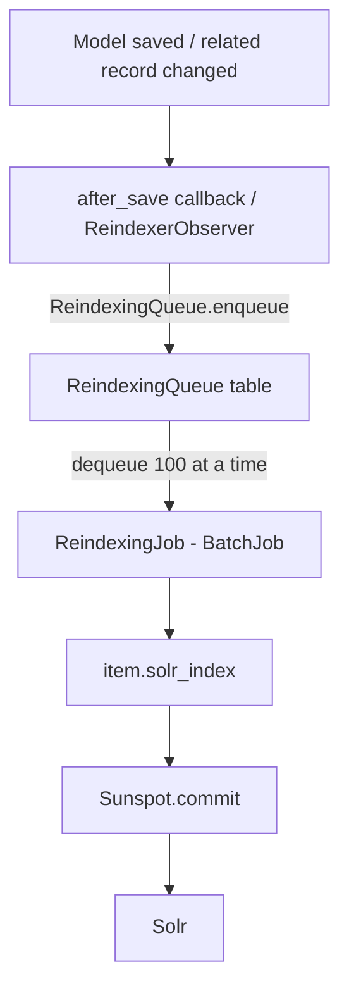

# Solr Search Indexing

SEEK uses [Apache Solr](https://solr.apache.org/) via the [Sunspot](https://github.com/sunspot/sunspot) gem for full-text search. Indexing is asynchronous — changes are queued in the database and processed by a background job rather than written to Solr inline.

Solr can be disabled via `Seek::Config.solr_enabled`. When disabled, all `searchable` blocks are skipped at class load time and search queries fall back to returning all records.

---

## High-Level Flow



---

## Configuration

**`config/sunspot.yml`** — connection settings per environment:

```yaml
production:
  solr:
    hostname: <%= ENV['SOLR_HOST'] || 'localhost' %>
    port: 8983
```

**`solr/seek/conf/schema.xml`** — field type definitions. The primary text field uses:
- `WhitespaceTokenizer`
- `ASCIIFoldingFilter` (normalises accented characters)
- `WordDelimiterGraphFilter` (splits on hyphens, camelCase, etc.)
- `LowerCaseFilter`
- `EdgeNGramFilter` (prefix matching)

---

## Making a Model Searchable

Models declare searchable fields inside a `searchable` block (Sunspot DSL). All SEEK models set `auto_index: false` — Sunspot will never index inline; that is handled exclusively via the queue.

```ruby
if Seek::Config.solr_enabled
  searchable(auto_index: false) do
    text :title
    text :description do
      strip_markdown(description)
    end
  end
end
```

The guard on `Seek::Config.solr_enabled` means the entire block is omitted if Solr is off — no schema cost at boot.

### Common fields (`Seek::Search::CommonFields`)

Included in all asset models via `acts_as_asset`. Adds these fields to every asset type:

| Field | Content |
|---|---|
| `title` | Resource title |
| `description` | Description with Markdown stripped |
| `searchable_tags` | Annotation tags |
| `contributor` | Name of the contributing person |
| `projects` | Titles of associated projects |
| `programmes` | Titles of associated programmes |
| `external_asset` | Search terms from linked external assets |

Additional shared fields added by other concerns:

- `creators`, `unregistered_creators`, `other_creators` — all author/creator names
- `content_blob` — text extracted from uploaded file content
- `assay_type_titles`, `technology_type_titles` — from assay associations
- `git_content` — for git-versioned assets
- `extended_metadata_attribute_values` — custom metadata values (via `has_extended_metadata`)
- `external_identifier` — identifiers from linked external systems

### Model-specific fields

| Model | Extra indexed fields |
|---|---|
| `Publication` | `journal`, `pubmed_id`, `doi`, `published_date`, `human_disease_terms`, `publication_authors`, `non_seek_authors` |
| `Model` | `organism_terms`, `human_disease_terms`, `model_contents_for_search`, `model_format.title`, `model_type.title`, `recommended_environment.title` |
| `Sample` | `attribute_values` (JSON metadata), `sample_type.title` |
| `Assay` | `organism_terms`, `human_disease_terms`, `assay_type_label`, `technology_type_label`, `strains` |
| `Person` | `expertise`, `tools`, `disciplines` |
| `Programme` | `funding_details`, `institutions` |
| `Institution` | `city`, `address` |
| `Organism` | `searchable_terms` (title, synonyms, definitions), `ncbi_id` |
| `HumanDisease` | `searchable_terms` (title, synonyms, definitions), `doid_id` |
| `Strain` | `synonym`, `genotype_info`, `phenotype_info`, `provider_name`, `provider_id` |
| `SampleType` | `attribute_search_terms` |
| `Event` | `address`, `city`, `country`, `url` |
| `ISATag` | `title` |

The full list of searchable types is available at runtime via `Seek::Util.searchable_types`.

---

## Indexing Pipeline

### 1. Queueing on save

`Seek::Search::BackgroundReindexing` (`lib/seek/search/background_reindexing.rb`) is included in all asset models via `acts_as_asset`. It adds an `after_save` callback:

```ruby
def queue_background_reindexing
  return unless Seek::Config.solr_enabled
  unless (saved_changes.keys - ['updated_at']).empty?
    ReindexingQueue.enqueue(self)
  end
end
```

The `updated_at`-only exclusion prevents unnecessary reindexing when only the timestamp changes (e.g. touching a record).

### 2. ReindexingQueue

`ReindexingQueue` (`app/models/reindexing_queue.rb`) stores pending items in the database using the `ResourceQueue` concern. Calling `ReindexingQueue.enqueue(items)` also schedules `ReindexingJob` to run if one isn't already queued.

### 3. ReindexingJob

`ReindexingJob` (`app/jobs/reindexing_job.rb`) extends `BatchJob`:

- Dequeues up to **100 items** at a time from `ReindexingQueue`
- Calls `item.solr_index` on each (Sunspot's per-record index method)
- Calls `Sunspot.commit` at the end of each batch to flush to Solr
- If the queue still has items after the batch, it enqueues a follow-on job
- Time limit: **1 hour**

---

## Reindex Observers

Changes to secondary/related models trigger reindexing of linked resources. Each observer subclasses `ReindexerObserver < ActiveRecord::Observer` and implements `consequences(item)` to return the items that need reindexing.

| Observer | Observes | Reindexes |
|---|---|---|
| `ContentBlobReindexer` | `ContentBlob` | The blob's parent asset |
| `AnnotationReindexer` | `Annotation` | The annotatable item and its `reindexing_consequences` |
| `AssayReindexer` | `Assay` | Assets linked to the assay |
| `AssayAssetReindexer` | `AssayAsset` | The assay and the asset |
| `AssetsCreatorReindexer` | `AssetsCreator` | The related asset |
| `PersonReindexer` | `Person` | Assets contributed by the person |
| `ProgrammeReindexer` | `Programme` | Programme and its related items |

Two additional model-level callbacks:

- **`ExternalAsset`** — `after_save :trigger_reindexing` when external content changes
- **`Snapshot`** — `after_save :reindex_parent_resource` when a DOI is saved on a snapshot

---

## Search Queries

`ApplicationRecord.with_search_query(q)` (`app/models/application_record.rb:105`) is the entry point for all model searches:

```ruby
def self.with_search_query(q)
  if searchable? && Seek::Config.solr_enabled
    ids = solr_cache(q) do
      search = search do |query|
        query.keywords(q)
        query.paginate(page: 1, per_page: unscoped.count)
      end
      search.hits.map(&:primary_key)
    end
    where(id: ids)
  else
    all
  end
end
```

Key points:

- Uses Sunspot's `keywords` for full-text matching across all indexed text fields
- Paginates to return all matching IDs in one shot (fetches count first)
- Results are cached per-request in `RequestStore` keyed by `[table_name][query]` — the same Solr query within a single request is never executed twice
- Returns an ActiveRecord relation (`where(id: ids)`) so authorization scopes and other query chains apply normally

`SearchController` calls `with_search_query` on each searchable type (or all types for a global search) then filters results through `authorized_for('view')` for the current user.

---

## Full Reindex

To rebuild the entire search index (e.g. after schema changes or data migrations):

```bash
bundle exec rake seek:reindex_all
```

This queues a `ReindexAllJob` for each searchable type. Each job calls `type.solr_reindex(batch_size: ...)` (Sunspot's bulk reindex method). Batch size is configured via `Seek::Config.reindex_all_batch_size`. Each job has a **2-hour** time limit.

---

## Development Setup

SEEK includes Docker helper scripts for running a local Solr instance:

```bash
script/start-docker-solr.sh   # start
script/stop-docker-solr.sh    # stop
script/reset-docker-solr.sh   # wipe and restart
```

After starting Solr, run `rake seek:reindex_all` to populate the index from the database.
