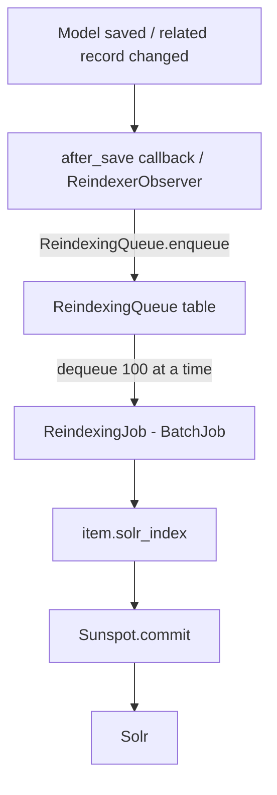

# Solr Search Indexing

SEEK uses [Apache Solr](https://solr.apache.org/) via the [Sunspot](https://github.com/sunspot/sunspot) gem for full-text search. Indexing is asynchronous — changes are queued in the database and processed by a background job rather than written to Solr inline.

Solr can be disabled via `Seek::Config.solr_enabled`. When disabled, all `searchable` blocks are skipped at class load time and search queries fall back to returning all records. Removal on destroy is guarded too: `ApplicationRecord#remove_from_index` overrides Sunspot's version to call `solr_remove_from_index` only when the class is searchable **and** `solr_enabled` is true — before #2736, destroying a record on an instance with Solr disabled tried to contact Solr.

---

## High-Level Flow


```mermaid
graph TD
    A[Model saved / related record changed]
    B[after_save callback / ReindexerObserver]
    C[ReindexingQueue table]
    D[ReindexingJob - BatchJob]
    E[item.solr_index]
    F[Sunspot.commit]
    G[Solr]

    A --> B
    B -->|ReindexingQueue.enqueue| C
    C -->|dequeue 100 at a time| D
    D --> E
    E --> F
    F --> G
```

---

## Configuration

**`config/sunspot.yml`** — connection settings per environment:

```yaml
production:
  solr:
    hostname: <%= ENV['SOLR_HOST'] || 'localhost' %>
    port: 8983
```

**`solr/seek/conf/managed-schema`** — field type definitions. The `text` field type's index-time analyzer chain is:
- `WhitespaceTokenizer`
- `ASCIIFoldingFilter` (normalises accented characters, `preserveOriginal="true"`)
- `WordDelimiterGraphFilter` (splits on hyphens, numbers, etc.)
- `FlattenGraphFilter` (required after a graph filter at index time)
- `LowerCaseFilter`
- `EdgeNGramFilter` (prefix matching, 2–50 characters)

The query-time analyzer is the same minus `FlattenGraphFilter` and `EdgeNGramFilter` — prefixes are generated when indexing, not when querying.

**`solr/seek/conf/solrconfig.xml`** — request handlers and search components, including the spellcheck component described below.

SEEK runs against **Solr 9** (the Docker compose files use `solr:9.10.1`). The bundled configuration was migrated for Solr 9: `LatLonType` is replaced by `LatLonPointSpatialField`, and elements Solr 9 rejects (such as `maxBooleanClauses` in `solrconfig.xml`) have been removed. An existing core carried over from Solr 8 needs its `conf` directory replaced and the index rebuilt.

---

## Making a Model Searchable

Models declare searchable fields inside a `searchable` block (Sunspot DSL). All SEEK models set `auto_index: false` — Sunspot will never index inline; that is handled exclusively via the queue.

```ruby
if Seek::Config.solr_enabled
  searchable(auto_index: false) do
    text :title
    text :description do
      strip_markdown(description)
    end
  end
end
```

The guard on `Seek::Config.solr_enabled` means the entire block is omitted if Solr is off — no schema cost at boot.

### Common fields (`Seek::Search::CommonFields`)

Included in all asset models via `acts_as_asset`. Adds these fields to every asset type:

| Field | Content |
|---|---|
| `title` | Resource title |
| `description` | Description with Markdown stripped |
| `searchable_tags` | Annotation tags |
| `contributor` | Name of the contributing person |
| `projects` | Titles of associated projects |
| `programmes` | Titles of associated programmes |
| `external_asset` | Search terms from linked external assets |

Additional shared fields added by other concerns:

- `creators`, `unregistered_creators`, `other_creators` — all author/creator names
- `content_blob` — text extracted from uploaded file content
- `assay_type_titles`, `technology_type_titles` — from assay associations
- `git_content` — for git-versioned assets
- `extended_metadata_attribute_values` — custom metadata values (via `has_extended_metadata`)
- `external_identifier` — identifiers from linked external systems

### Model-specific fields

| Model | Extra indexed fields |
|---|---|
| `Publication` | `journal`, `pubmed_id`, `doi`, `published_date`, `human_disease_terms`, `publication_authors`, `non_seek_authors` |
| `Model` | `organism_terms`, `human_disease_terms`, `model_contents_for_search`, `model_format.title`, `model_type.title`, `recommended_environment.title` |
| `Sample` | `attribute_values` (JSON metadata), `sample_type.title` |
| `Assay` | `organism_terms`, `human_disease_terms`, `assay_type_label`, `technology_type_label`, `strains` |
| `Person` | `expertise`, `tools`, `disciplines` |
| `Programme` | `funding_details`, `institutions` |
| `Institution` | `city`, `address` |
| `Organism` | `searchable_terms` (title, synonyms, definitions), `ncbi_id` |
| `HumanDisease` | `searchable_terms` (title, synonyms, definitions), `doid_id` |
| `Strain` | `synonym`, `genotype_info`, `phenotype_info`, `provider_name`, `provider_id` |
| `SampleType` | `attribute_search_terms` |
| `Event` | `address`, `city`, `country`, `url` |
| `ISATag` | `title` |

The full list of searchable types is available at runtime via `Seek::Util.searchable_types`.

---

## Indexing Pipeline

### 1. Queueing on save

`Seek::Search::BackgroundReindexing` (`lib/seek/search/background_reindexing.rb`) is included in all asset models via `acts_as_asset`. It adds an `after_save` callback:

```ruby
def queue_background_reindexing
  return unless Seek::Config.solr_enabled
  unless (saved_changes.keys - ['updated_at']).empty?
    ReindexingQueue.enqueue(self)
  end
end
```

The `updated_at`-only exclusion prevents unnecessary reindexing when only the timestamp changes (e.g. touching a record).

### 2. ReindexingQueue

`ReindexingQueue` (`app/models/reindexing_queue.rb`) stores pending items in the database using the `ResourceQueue` concern. Calling `ReindexingQueue.enqueue(items)` also schedules `ReindexingJob` to run if one isn't already queued.

### 3. ReindexingJob

`ReindexingJob` (`app/jobs/reindexing_job.rb`) extends `BatchJob`:

- Dequeues up to **100 items** at a time from `ReindexingQueue`
- Calls `item.solr_index` on each (Sunspot's per-record index method)
- Calls `Sunspot.commit` at the end of each batch to flush to Solr
- If the queue still has items after the batch, it enqueues a follow-on job
- Time limit: **1 hour**

---

## Reindex Observers

Changes to secondary/related models trigger reindexing of linked resources. Each observer subclasses `ReindexerObserver < ActiveRecord::Observer` and implements `consequences(item)` to return the items that need reindexing.

| Observer | Observes | Reindexes |
|---|---|---|
| `ContentBlobReindexer` | `ContentBlob` | The blob's parent asset |
| `AnnotationReindexer` | `Annotation` | The annotatable item and its `reindexing_consequences` |
| `AssayReindexer` | `Assay` | Assets linked to the assay |
| `AssayAssetReindexer` | `AssayAsset` | The assay and the asset |
| `AssetsCreatorReindexer` | `AssetsCreator` | The related asset |
| `PersonReindexer` | `Person` | Assets contributed by the person |
| `ProgrammeReindexer` | `Programme` | Programme and its related items |

Two additional model-level callbacks:

- **`ExternalAsset`** — `after_save :trigger_reindexing` when external content changes
- **`Snapshot`** — `after_save :reindex_parent_resource` when a DOI is saved on a snapshot

---

## Search Queries

`ApplicationRecord.with_search_query(q)` (`app/models/application_record.rb:105`) is the entry point for all model searches:

```ruby
def self.with_search_query(q)
  if searchable? && Seek::Config.solr_enabled
    ids = solr_cache(q) do
      search = search do |query|
        query.keywords(q)
        query.paginate(page: 1, per_page: unscoped.count)
      end
      search.hits.map(&:primary_key)
    end
    where(id: ids)
  else
    all
  end
end
```

Key points:

- Uses Sunspot's `keywords` for full-text matching across all indexed text fields
- Paginates to return all matching IDs in one shot (fetches count first)
- Results are cached per-request in `RequestStore` keyed by `[table_name][query]` — the same Solr query within a single request is never executed twice
- Returns an ActiveRecord relation (`where(id: ids)`) so authorization scopes and other query chains apply normally

`SearchController` calls `with_search_query` on each searchable type (or all types for a global search) then filters results through `authorized_for('view')` for the current user.

The query string is sanitised and stripped but its **case is preserved**, so Solr's boolean operators (`AND`, `OR`, `NOT`) work as typed.

---

## Spelling Suggestions ("did you mean")

The search page offers a corrected spelling when Solr thinks the query was misspelled.

The obstacle is that the `*_text` dynamic fields Sunspot writes all full text into are edge n-grammed, so every prefix in them looks like a correctly spelled word — useless as a dictionary. A dedicated field is therefore maintained alongside them:

```xml
<field name="spellcheck_dictionary" stored="false" type="spell" multiValued="true" indexed="true"/>
<copyField source="*_text"  dest="spellcheck_dictionary"/>
<copyField source="*_texts" dest="spellcheck_dictionary"/>
```

The `spell` field type is deliberately plain — `StandardTokenizer`, `ASCIIFoldingFilter`, `LowerCaseFilter`, and no n-gramming. The name avoids a `_text` suffix so the `*_text` copyField glob doesn't match the field itself and feed it back into itself.

`solrconfig.xml` points the spellcheck component at that field using `DirectSolrSpellChecker`, which reads the live index rather than needing a separately built dictionary:

```xml
<searchComponent name="spellcheck" class="solr.SpellCheckComponent">
  <lst name="spellchecker">
    <str name="name">default</str>
    <str name="field">spellcheck_dictionary</str>
    <str name="classname">solr.DirectSolrSpellChecker</str>
    <int name="minQueryLength">4</int>
    <float name="accuracy">0.5</float>
    ...
  </lst>
</searchComponent>
```

`SearchController#spelling_suggestion` runs a **second, `rows=1` query** purely to get the spellcheck response, and offers Solr's collation only when it differs from what the user typed:

```ruby
def spelling_suggestion(query, sources)
  search = Sunspot.new_search(*sources) do |s|
    s.keywords(query)
    s.spellcheck(q: query, collate: true)
    s.paginate(page: 1, per_page: 1)
  end
  search.execute

  collation = Array(search.solr_spellcheck['collations']).last
  collation if collation.present? && collation.downcase != query.downcase
rescue StandardError => e
  Rails.logger.warn("Unable to fetch spelling suggestions from Solr: #{e.message}")
  nil
end
```

Two deliberate choices:

- **Skipped for JSON requests** — it is a UI nicety, not part of the API.
- **Any Solr error is logged and swallowed.** A missing or misconfigured spellcheck component must never fail the search itself.

Existing Solr cores need their `conf` updated and a reindex before suggestions appear; `rake seek:upgrade` already reindexes.

---

## Full Reindex

To rebuild the entire search index (e.g. after schema changes or data migrations):

```bash
bundle exec rake seek:reindex_all
```

This queues a `ReindexAllJob` for each searchable type. Each job calls `type.solr_reindex(batch_size: ...)` (Sunspot's bulk reindex method). Batch size is configured via `Seek::Config.reindex_all_batch_size`. Each job has a **2-hour** time limit.

---

## Development Setup

SEEK includes Docker helper scripts for running a local Solr instance:

```bash
script/start-docker-solr.sh   # start
script/stop-docker-solr.sh    # stop
script/reset-docker-solr.sh   # wipe and restart
```

After starting Solr, run `rake seek:reindex_all` to populate the index from the database.
